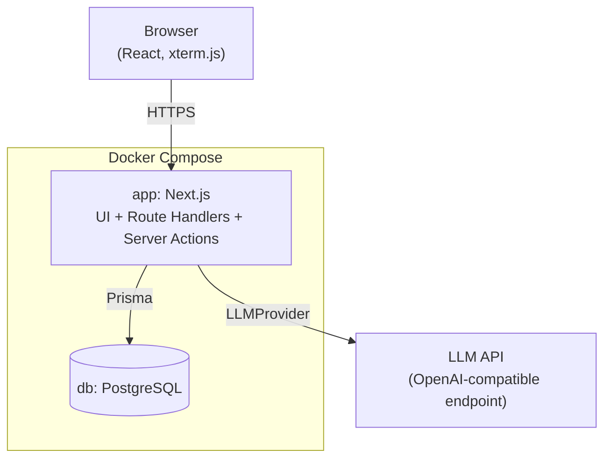
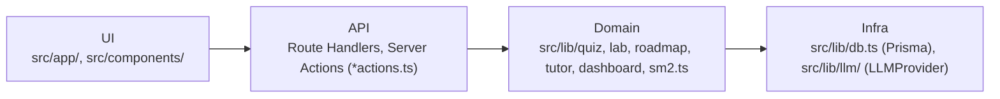
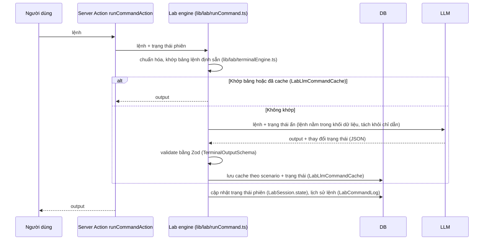

# SE Dojo: kiến trúc, quy ước và workflow

> Nguồn tham chiếu chính cho cả người lẫn Claude Code khi thêm tính năng hoặc bảo trì.
>
> Mục 3 (cấu trúc thư mục) và mục 4 (entity) đã được đối chiếu với code thực tế
> (2026-10-05) và cập nhật để khớp — coi là chuẩn hiện tại. Phần còn lại (quy ước, workflow,
> ADR) là định hướng ban đầu, đến nay code đã theo đúng gần như toàn bộ; vài chỗ lệch được
> ghi rõ trong mục 9 (nợ kỹ thuật) thay vì sửa âm thầm.

## 1. Tổng quan

SE Dojo là web app nội bộ để team System Engineer học và rèn luyện kiến thức SE,
Network, DevOps qua bốn hình thức: quiz/flashcard, lab troubleshooting với terminal
giả lập, roadmap kỹ năng, và AI tutor.

**Yêu cầu chức năng**

| Nhóm | Mô tả |
|---|---|
| Quiz, flashcard | LLM sinh câu hỏi theo chủ đề và độ khó, lưu lại để tái sử dụng; flashcard ôn theo SM-2 |
| Lab | Scenario troubleshooting do LLM sinh, chạy trên terminal mô phỏng, chấm bài theo rubric |
| Roadmap | Cây kỹ năng theo chủ đề, trạng thái node tính từ kết quả quiz và lab |
| Tutor | Chat có ngữ cảnh, chấm câu trả lời tự luận |
| Admin | Quản lý user, chủ đề, nội dung bị báo sai, thống kê lượng gọi LLM |

**Yêu cầu phi chức năng**

| Thuộc tính | Mục tiêu |
|---|---|
| Quy mô | 4-10 người dùng nội bộ, không thiết kế cho tải lớn |
| Triển khai | On-prem, một lệnh `docker compose up`, phụ thuộc ngoài duy nhất là LLM API |
| An toàn | Không thực thi lệnh thật; API key chỉ nằm ở server; input người dùng là dữ liệu không tin cậy |
| Chi phí LLM | Cache mọi nội dung đã sinh, rate limit theo user, ghi log token |
| Bảo trì | Một codebase TypeScript, prompt tách file, logic lõi có test |
| Khả dụng | Best effort; LLM lỗi thì nội dung đã cache vẫn dùng được |

## 2. Kiến trúc



Bên trong service `app`, code chia thành ba lớp và chỉ được gọi theo một chiều:



- **UI** không gọi Prisma hay LLM trực tiếp.
- **Domain** chứa toàn bộ luật nghiệp vụ, không phụ thuộc Next.js, test được độc lập.
- **Infra** là nơi duy nhất biết về DB và nhà cung cấp LLM.
- Phần lớn mutation đi qua **Server Actions** (file `actions.ts` cạnh `page.tsx` của từng
  route), không phải REST route riêng — chỉ 3 Route Handler thật sự tồn tại:
  `/api/auth/[...nextauth]` (NextAuth), `/api/health` (healthcheck), `/api/tutor/chat`
  (cần Route Handler vì trả về `ReadableStream` cho streaming, Server Action không làm được).

### Luồng xử lý một lệnh trong lab

Đây là luồng phức tạp nhất của hệ thống, cần hiểu trước khi sửa phần lab.



### Chế độ lỗi

| Sự cố | Hành vi mong muốn | Trạng thái hiện tại |
|---|---|---|
| LLM timeout hoặc lỗi | Retry tối đa 2 lần; quiz dùng câu đã cache; lab báo "terminal tạm thời không phản hồi", không mất phiên | Retry 2 lần ✅ (`OpenAICompatibleProvider`, dùng chung cho mọi lỗi kể cả timeout). Phiên không mất ✅. Thông báo lab hiện là message kỹ thuật thô (`[lỗi] ...`), chưa phải câu thân thiện — xem mục 9 |
| LLM trả sai schema | Retry với thông báo lỗi validate; vẫn sai thì báo lỗi rõ ràng, không lưu dữ liệu hỏng | Đúng như đặc tả ✅ (`LLMOutputValidationError`, không ghi DB nếu parse thất bại) |
| Vượt rate limit | Trả 429 kèm thời gian chờ, UI hiển thị thân thiện | Chưa đúng — hiện chỉ throw Error chung (`RateLimitExceededError`), chưa có status 429 hay thời gian chờ cụ thể — xem mục 9 |
| DB không kết nối được | Healthcheck fail, container `app` không nhận traffic | Đúng như đặc tả ✅ (`/api/health` query thử DB, Docker Compose healthcheck) |
| Nội dung AI sinh sai | Người dùng bấm "Báo câu sai", nội dung bị ẩn ngay và vào hàng chờ admin | Đúng cho **câu hỏi quiz** ✅ (`QuestionFlag`, trang `/admin/flagged`). **Chưa có** cơ chế tương đương cho lab scenario/skill node — xem mục 9 |

## 3. Cấu trúc thư mục

Khớp code thực tế (đối chiếu 2026-10-05):

```
.
├── src/
│   ├── app/
│   │   ├── login/              # Đăng nhập (không cần auth, ngoài route group)
│   │   ├── (app)/               # Route group cần đăng nhập — layout dùng chung (AppShell)
│   │   │   ├── dashboard/  quiz/  flashcards/  lab/  roadmap/  team/  tutor/
│   │   │   ├── admin/            # users/, topics/, usage/, flagged/
│   │   │   └── actions.ts        # Server Action dùng chung cho layout (logout)
│   │   ├── api/                  # 3 Route Handler: auth/[...nextauth], health, tutor/chat
│   │   ├── layout.tsx             # Root layout: font, ThemeProvider
│   │   └── page.tsx                # "/" redirect -> /dashboard
│   ├── components/
│   │   ├── ui/                   # shadcn/ui, không chứa nghiệp vụ
│   │   ├── shell/                 # App shell: sidebar, topbar, command palette, user menu
│   │   └── <feature>/              # dashboard/, quiz/, flashcard/, lab/, roadmap/, tutor/
│   ├── lib/
│   │   ├── db.ts                  # Prisma client singleton (driver adapter)
│   │   ├── auth.ts, rbac.ts, password.ts   # Auth + phân quyền + hash mật khẩu
│   │   ├── sm2.ts                  # Thuật toán SM-2 (file đơn, không phải thư mục srs/)
│   │   ├── llm/                     # LLMProvider, schemas Zod, rate limit, providers/
│   │   ├── quiz/  lab/  roadmap/  tutor/  dashboard/   # Domain theo tính năng
│   │   └── utils.ts                  # Helper `cn()` (shadcn)
│   ├── proxy.ts                      # Route protection — tên `proxy.ts` do Next.js 16 quy
│   │                                   định (đổi từ middleware.ts), KHÔNG phải lựa chọn riêng
│   ├── types/next-auth.d.ts            # Module augmentation cho session/JWT
│   └── generated/prisma/                # Prisma Client sinh ra (gitignored)
├── prompts/                 # Mỗi prompt 1 file, có `version`: quiz/, lab/, roadmap/, tutor/
├── prisma/                  # schema.prisma, seed.ts, migrations/
├── docs/
│   ├── ARCHITECTURE.md       # File này
│   └── adr/                   # ADR MỚI từ nay trở đi (ADR nền tảng nằm ở mục 7 dưới đây)
├── docker-compose.yml, Dockerfile, docker-entrypoint.sh
├── .env.example
└── CLAUDE.md                 # Trỏ về file này + ghi chú triển khai chi tiết/gotcha
```

**Khác với bản thiết kế ban đầu** (ghi lại để không ai mất công tìm `tests/` hay `app/admin/`
ở gốc):

- Toàn bộ nằm dưới `src/` (quy ước `src/` của Next.js App Router), không phải `app/`,
  `components/`, `lib/` ở gốc repo.
- Không có route group `(auth)`/`(main)` tách riêng — chỉ `login/` (public) và `(app)/` (toàn
  bộ phần cần đăng nhập, gồm cả `admin/` lồng bên trong, không phải `app/admin/` ở gốc).
- Không có thư mục `tests/` riêng — test là file `*.test.ts` nằm cạnh file nguồn
  (colocated), chạy bằng Vitest. Quyết định này giữ nguyên, không phải nợ kỹ thuật.
- `lib/db/`, `lib/auth/` trong bản gốc là thư mục — thực tế là file đơn (`db.ts`, `auth.ts`)
  vì mỗi phần chưa đủ lớn để tách nhiều file.
- `lib/srs/` trong bản gốc — thực tế là `lib/sm2.ts` (1 thuật toán, không cần thư mục).
- `lib/tutor/` và `lib/dashboard/` tồn tại nhưng không có trong sơ đồ domain gốc — bổ sung khi
  xây AI tutor (GĐ5) và dashboard tổng hợp (GĐ4).

Quy tắc đặt code: nếu phân vân một đoạn logic thuộc về đâu, hỏi "nó có cần Next.js để
chạy không?". Không cần thì thuộc `lib/<domain>/`.

## 4. Mô hình dữ liệu

Khớp `prisma/schema.prisma` thực tế (đối chiếu 2026-10-05):

| Entity | Vai trò |
|---|---|
| `User` | Tài khoản, role `ADMIN` hoặc `MEMBER` |
| `Topic` | Chủ đề học (Linux, Networking...) |
| `SkillNode` | Node trong cây kỹ năng của một topic — quan hệ **cha-con** (`parentId`/`children`), chưa phải DAG tiên quyết đầy đủ (xem mục 9) |
| `Question` | Câu trắc nghiệm đã sinh: `stem`, `difficulty`, `source` (LLM/ADMIN), `status` (ACTIVE/FLAGGED/HIDDEN) |
| `QuestionOption` | Từng đáp án của 1 `Question`: text, `isCorrect`, `explanation` — bảng con riêng, không phải cột trên `Question` |
| `QuestionFlag` | Lượt báo sai 1 câu hỏi (user, lý do, đã xử lý hay chưa) — đây là cơ chế "báo nội dung sai" **chỉ cho quiz**, chưa có bản tương đương cho lab/roadmap |
| `QuizAttempt` | Một lần trả lời 1 câu, đúng/sai |
| `FlashcardState` | Trạng thái SM-2 của 1 user cho 1 `Question` (easeFactor, intervalDays, repetitions, dueAt) — **không có entity `Flashcard` riêng**: flashcard chính là `Question`, chỉ khác cách ôn |
| `LabScenario` | Định nghĩa lab (JSON ở cột `data`): bối cảnh, trạng thái ẩn, bảng lệnh, rootCause, rubric. Có `promptVersion` |
| `LabScenarioNode` | Bảng nối N-N giữa `SkillNode` và `LabScenario` (1 node có thể gắn nhiều lab và ngược lại) |
| `LabSession` | Phiên lab của user: `state` (JSON, trạng thái hiện tại), `status` (IN_PROGRESS/SUBMITTED/COMPLETED) |
| `LabCommandLog` | Lịch sử từng lệnh đã chạy trong 1 phiên + output + nguồn (PRESET/LLM) |
| `LabLlmCommandCache` | Output LLM đã sinh cho (scenario, trạng thái, lệnh chuẩn hoá) — tách riêng khỏi `LabCommandLog` (log là lịch sử theo phiên, cache là tái sử dụng giữa các phiên/user) |
| `LabHintUsage` | Lượt dùng gợi ý (level 1-3) của 1 phiên |
| `LabSubmission` | Bài nộp cuối (rootCauseText, fixText) + điểm (JSON) + feedback — 1-1 với `LabSession` |
| `ChatSession`, `ChatMessage` | Hội thoại AI tutor — đặt tên chung `Chat*` chứ không phải `Tutor*`, vì cùng cơ chế này dùng cho mọi ngữ cảnh chat (không chỉ tutor); `contextType` (NODE/QUESTION/LAB) + `contextId` xác định ngữ cảnh đang gắn |
| `LlmUsageLog` | Log mỗi lần gọi LLM: user, `feature`, `model`, token, latency, success |

**Khác với bản thiết kế ban đầu:**

- Không có `Scenario` → tên thật là `LabScenario` (tiền tố `Lab` nhất quán cho mọi entity
  thuộc domain lab: `LabSession`, `LabCommandLog`, `LabLlmCommandCache`, `LabHintUsage`,
  `LabSubmission`, `LabScenarioNode`).
- Không có `CommandCache` đơn lẻ → tách thành `LabCommandLog` (lịch sử) + `LabLlmCommandCache`
  (cache tái sử dụng), vì hai mục đích khác nhau (lịch sử theo phiên vs. cache chia sẻ).
- Không có `TutorThread`/`TutorMessage` → `ChatSession`/`ChatMessage` (tên tổng quát hơn).
- Không có `ContentReport` tổng quát → chỉ có `QuestionFlag`, scoped riêng cho `Question`.
- Không có `Flashcard` tách biệt khỏi `Question` → `FlashcardState` chỉ lưu trạng thái SM-2,
  trỏ thẳng vào `Question` làm nội dung.

**Về `promptVersion`/`model` để truy nguồn gốc** (quy ước ở mục 5): hiện **chỉ `LabScenario`
có cột `promptVersion`** (chưa có `model`). `Question` chỉ có `source` (LLM/ADMIN), không có
`promptVersion`. `SkillNode` không có cột nào trong nhóm này. Nghĩa là quy ước "luôn lưu kèm
promptVersion và model" ở mục 5 **chưa được áp dụng đầy đủ** — xem mục 9.

## 5. Quy ước

### Code

- TypeScript strict, không dùng `any`; kiểu dữ liệu từ bên ngoài (request, LLM) suy ra từ schema Zod.
- Tên file `kebab-case.ts` (component mới) hoặc `camelCase.ts` (file domain đã có từ trước,
  ví dụ `questionPool.ts`, `nodeStatus.ts` — giữ nguyên để không phải rename hàng loạt,
  nhưng **file mới theo domain nên dùng `kebab-case.ts`** để nhất quán dần), component
  `PascalCase`, hàm và biến `camelCase`, model Prisma `PascalCase`.
- Server Component là mặc định; chỉ thêm `"use client"` khi cần state hoặc sự kiện.
- Mọi Route Handler/Server Action theo cùng trình tự: xác thực (`requireUser`/`requireAdmin`
  từ `lib/rbac.ts`), validate input bằng Zod khi input có cấu trúc phức tạp (form đơn giản có
  thể validate trực tiếp), gọi domain, trả kết quả.
- Lỗi throw ra từ Server Action hiện là `Error` thường (message tiếng Việt cho người dùng),
  **chưa có dạng thống nhất `{ error: { code, message } }`** như đặc tả gốc — xem mục 9.
- Không đọc `process.env` rải rác; gom vào `lib/config.ts` và validate khi khởi động —
  **chưa áp dụng**, hiện đọc trực tiếp ở `lib/db.ts`, `lib/llm/*` — xem mục 9.

### LLM và prompt

- Chỉ gọi LLM qua `LLMProvider` (`src/lib/llm/provider.ts`). Không import SDK của nhà cung cấp ở nơi khác.
- Mỗi prompt là một file trong `prompts/`, có `version` ở đầu file (`export const version = "..."`).
  Sửa nội dung prompt thì tăng version (ví dụ `quiz.generate.v1` → `v2`, tạo file mới, không
  sửa đè file cũ).
- Output có cấu trúc bắt buộc qua Zod (`src/lib/llm/schemas.ts`) trước khi dùng hoặc lưu, retry
  tối đa 2 lần nếu sai schema.
- Input của người dùng luôn đặt trong khối dữ liệu tách biệt với chỉ dẫn (ví dụ thẻ
  `<user-command>`), không nối chuỗi vào phần chỉ dẫn.
- Nguyên nhân gốc và rubric của scenario không bao giờ được gửi về client trước khi nộp bài.
- Mọi lời gọi LLM thật (`OpenAICompatibleProvider`) đều ghi `LlmUsageLog`; `MockLLMProvider`
  cũng được bọc ghi log qua `withTracking` (`lib/llm/providers/tracked.ts`) để nhất quán khi
  team dùng `LLM_PROVIDER=mock`. Kiểm tra cache trước khi gọi (lab: `LabLlmCommandCache`; quiz/
  roadmap: kiểm tra số lượng đã có trong DB trước khi sinh thêm).

### Cơ sở dữ liệu

- Đổi schema chỉ qua `prisma migrate`; không sửa migration đã merge.
- Migration phá hủy dữ liệu (xóa cột, đổi kiểu) tách thành hai bước và ghi chú trong PR.
- Truy vấn dùng lại nhiều nơi đặt trong `lib/<domain>/` (ví dụ `lib/roadmap/progress.ts`
  gộp nhiều truy vấn roadmap dùng chung cho dashboard/team/roadmap), không lặp lại trong route.
- **Prisma 7 bắt buộc driver adapter** (`@prisma/adapter-pg`), không có `url` trong block
  `datasource` của `schema.prisma` — xem `CLAUDE.md` để biết chi tiết và các lưu ý phiên bản.

### Giao diện

- Màu, cỡ chữ, spacing lấy từ design tokens (CSS variables ở `src/app/globals.css`); không
  hardcode mã màu trong component.
- Dùng component trong `components/ui/` trước khi tạo mới.
- Mỗi màn hình có đủ trạng thái loading, rỗng, lỗi.
- Text giao diện tiếng Việt; lệnh, tên công cụ, thuật ngữ kỹ thuật giữ nguyên tiếng Anh.
- Xem thêm mục "Design system" trong `CLAUDE.md` (đang làm lại giao diện theo từng màn hình).

### Git

- Nhánh: `feat/<mo-ta>`, `fix/<mo-ta>`, `chore/<mo-ta>`; `main` luôn chạy được.
- Commit theo Conventional Commits: `feat(lab): thêm gợi ý mức 3`. (Lịch sử trước khi có tài
  liệu này dùng tiếng Việt tự do kiểu `GĐ3: lab troubleshooting...` — từ nay commit mới theo
  Conventional Commits như trên.)
- Mỗi PR một mục đích; thay đổi schema hoặc prompt nêu rõ trong mô tả.

## 6. Workflow

### Chạy local

Dự án dùng **pnpm** (không phải npm — xem `"packageManager"` trong `package.json`), Prisma
config là `prisma7.config.ts` (không phải `prisma.config.ts`, xem `CLAUDE.md`):

```bash
cp .env.example .env          # điền LLM_BASE_URL, LLM_API_KEY, LLM_MODEL
docker compose up -d db
pnpm install
pnpm db:migrate
pnpm db:seed
pnpm dev
```

Đặt `LLM_PROVIDER=mock` trong `.env` để phát triển và chạy test mà không tốn API.

### Thêm một tính năng

1. Mô tả ngắn mục tiêu và phạm vi; nếu thay đổi kiến trúc thì viết ADR trước (mục 7).
2. Đổi schema (nếu cần) và tạo migration.
3. Viết logic trong `lib/<domain>/` kèm test.
4. Thêm Route Handler hoặc Server Action.
5. Làm UI, dùng lại component và tokens sẵn có.
6. Cập nhật file này nếu có entity, thư mục hoặc quy ước mới.
7. Chạy checklist mục 8, mở PR.

### Thêm một chủ đề học

1. Admin tạo `Topic` ở `/admin/topics`.
2. Vào `/roadmap/<slug>` lần đầu để trigger sinh cây kỹ năng (`ensureSkillTree`), rà lại và
   chỉnh node nếu cần (hiện **chưa có UI sửa node trong admin** — sửa trực tiếp qua
   `prisma studio` nếu cần, xem mục 9).
3. Vào `/quiz` và `/lab` với chủ đề mới để trigger sinh thử quiz/scenario, làm thử để kiểm tra
   chất lượng trước khi thông báo cho team.

Không cần sửa code. Nếu chủ đề cần lệnh đặc thù cho terminal (ví dụ NX-OS), bổ sung ví dụ
vào `prompts/lab/scenario-generate.v1.ts` và tăng version.

### Sửa một prompt

1. Tạo file version mới trong `prompts/<domain>/`, ví dụ `generate.v2.ts`; cập nhật chỗ import
   trong provider (`lib/llm/providers/openai-compatible.ts`) sang file mới.
2. Chạy thử với provider thật (`LLM_PROVIDER` khác `mock`) trên vài chủ đề mẫu.
3. So sánh 5-10 kết quả cũ và mới bằng mắt; ghi nhận xét vào PR.
4. Nội dung cũ vẫn giữ; nếu version cũ có lỗi hệ thống, ẩn hàng loạt theo `promptVersion` —
   **lưu ý**: chỉ `LabScenario` có `promptVersion` lưu sẵn để làm việc này, `Question` chưa có
   (xem mục 4, mục 9).

### Thêm một loại lệnh hoặc hành vi cho terminal

1. Viết test mô tả hành vi mong muốn cạnh `lib/lab/terminalEngine.ts`
   (`terminalEngine.test.ts`).
2. Sửa engine trong `lib/lab/`; giữ nguyên thứ tự: bảng định sẵn (`terminalEngine.ts`), cache
   (`LabLlmCommandCache` qua `runCommand.ts`), LLM.
3. Nếu đổi cấu trúc JSON của scenario (`src/lib/llm/schemas.ts` — `LabScenarioSchema`), cần
   viết hàm chuyển đổi cho scenario cũ đã lưu trong DB (chưa có `schemaVersion` tường minh
   trên `LabScenario.data` — hiện chỉ có `version: 1` cố định trong chính JSON đó).

### Triển khai và vận hành

```bash
git pull
docker compose up -d --build
```

`docker-entrypoint.sh` tự chạy `prisma migrate deploy` rồi seed (idempotent, dùng `upsert`)
trước khi start server mỗi lần container khởi động lại — không cần bước `migrate deploy` thủ
công riêng như một số setup Next.js/Prisma khác.

- **Backup:** `pg_dump` hằng ngày ra ngoài volume của container, giữ tối thiểu 7 bản.
  Thử restore định kỳ. (Lệnh `pg_dump`/`pg_restore` mẫu xem `README.md`.)
- **Rollback:** quay về image tag trước; migration phá hủy dữ liệu phải có bản backup ngay trước khi chạy.
- **Theo dõi:** endpoint `/api/health` (app + DB), log ra stdout (hiện là log mặc định của
  Next.js, **chưa phải JSON structured log** — xem mục 9), bảng `LlmUsageLog` cho chi phí
  (xem `/admin/usage`).

## 7. Quyết định kiến trúc (ADR)

ADR mới đặt tại `docs/adr/NNN-ten-ngan.md` theo mẫu: Trạng thái, Bối cảnh, Quyết định,
Phương án đã cân nhắc, Hệ quả. Bốn ADR nền tảng dưới đây mô tả các quyết định ban đầu, viết
lại trực tiếp trong tài liệu này vì đã định hình toàn bộ kiến trúc hiện tại.

### ADR-001: Monolith Next.js thay vì tách frontend và backend

- **Trạng thái:** Đã áp dụng.
- **Bối cảnh:** team nhỏ, dưới 10 người dùng, phát triển chủ yếu bằng Claude Code.
- **Quyết định:** một service Next.js (App Router) chứa cả UI và API.
- **Đã cân nhắc:** FastAPI + React (quen với hệ sinh thái Python của team, nhưng hai codebase, hai bộ kiểu dữ liệu phải giữ đồng bộ).
- **Hệ quả:** triển khai và bảo trì đơn giản, kiểu dữ liệu dùng chung từ DB (Prisma) đến UI qua
  Server Components/Actions. Đổi lại, tác vụ nền dài phải xử lý trong cùng tiến trình; nếu sau
  này cần worker riêng thì tách ra từ `lib/`.

### ADR-002: Terminal mô phỏng thay vì container thật

- **Trạng thái:** Đã áp dụng.
- **Bối cảnh:** lab cần an toàn tuyệt đối và nhẹ về hạ tầng.
- **Quyết định:** không thực thi lệnh thật; output đến từ bảng định sẵn (`presetCommands`),
  cache (`LabLlmCommandCache`), rồi mới đến LLM.
- **Đã cân nhắc:** container mỗi phiên (chân thực nhất, nhưng cần cô lập, dọn dẹp, giới hạn tài nguyên và mở ra rủi ro bảo mật).
- **Hệ quả:** không có bề mặt tấn công từ việc chạy lệnh, mô phỏng được cả thiết bị mạng. Đổi lại, output có thể thiếu nhất quán ở các lệnh hiếm; giảm thiểu bằng trạng thái phiên tường minh (`LabSession.state`) và cache.

### ADR-003: Nội dung do LLM sinh, không qua bước duyệt

- **Trạng thái:** Đã áp dụng.
- **Bối cảnh:** team không có thời gian soạn và duyệt nội dung.
- **Quyết định:** sinh tự động, lưu DB, dùng ngay.
- **Đã cân nhắc:** AI sinh rồi người duyệt (chất lượng cao hơn, nhưng tạo nút thắt).
- **Hệ quả:** nội dung phong phú, không tốn công soạn. Rủi ro là câu sai lọt đến người học;
  giảm thiểu bằng nút báo sai (hiện mới có cho quiz — xem mục 9) và lưu `promptVersion` để
  loại bỏ hàng loạt (hiện mới có đầy đủ cho `LabScenario` — xem mục 4, mục 9).

### ADR-004: Trừu tượng hóa nhà cung cấp LLM

- **Trạng thái:** Đã áp dụng.
- **Bối cảnh:** có thể gọi thẳng API hoặc qua proxy nội bộ, model sẽ thay đổi theo thời gian.
- **Quyết định:** interface `LLMProvider` (`src/lib/llm/provider.ts`), cấu hình hoàn toàn qua
  biến môi trường (`LLM_BASE_URL`, `LLM_API_KEY`, `LLM_MODEL`).
- **Hệ quả:** đổi endpoint hoặc model không cần sửa code, có `MockLLMProvider` cho test (ghi
  log/rate-limit qua wrapper `withTracking` để hành vi nhất quán với provider thật). Đổi lại,
  không dùng được tính năng riêng của một nhà cung cấp nếu chưa đưa vào interface.

## 8. Checklist trước khi merge

- [ ] `pnpm lint`, `pnpm typecheck`, `pnpm test` đều pass
- [ ] `pnpm build` (hoặc `docker compose build app`) thành công
- [ ] Đổi schema: có migration, đã thử trên bản sao dữ liệu
- [ ] Đổi prompt: đã tăng version, đã so sánh kết quả
- [ ] Không có secret trong code hay log; không gọi LLM từ client
- [ ] Endpoint/Server Action mới có `requireUser`/`requireAdmin` và validate input
- [ ] UI mới có trạng thái loading, rỗng, lỗi; dùng được ở cả hai theme (sáng/tối)
- [ ] Đã cập nhật tài liệu này nếu thay đổi cấu trúc hoặc quy ước

## 9. Rủi ro và nợ kỹ thuật

| Rủi ro | Mức | Giảm thiểu |
|---|---|---|
| Nội dung AI sai lọt đến người học | Trung bình | Nút báo sai cho quiz, ẩn tự động, truy vết theo `promptVersion` (một phần — xem nợ kỹ thuật) |
| Chi phí LLM tăng do terminal gọi nhiều | Trung bình | Bảng lệnh định sẵn, cache (`LabLlmCommandCache`), rate limit, theo dõi `LlmUsageLog` |
| Prompt injection qua input terminal hoặc chat | Trung bình | Tách dữ liệu khỏi chỉ dẫn, không trả rootCause/rubric về client, validate output bằng Zod |
| Mất dữ liệu tiến độ | Thấp | Backup hằng ngày (quy trình thủ công, chưa tự động hoá — xem nợ kỹ thuật), thử restore |
| Phụ thuộc một người hiểu hệ thống | Trung bình | Tài liệu này, ADR, `CLAUDE.md` luôn cập nhật |

Nợ kỹ thuật đã biết (phát hiện khi đối chiếu tài liệu này với code thực tế, 2026-10-05):

1. **`lib/config.ts` chưa tồn tại.** `process.env` đọc trực tiếp rải rác ở `lib/db.ts`,
   `lib/llm/provider.ts`, `lib/llm/rateLimiter.ts`, `lib/llm/providers/{openai-compatible,
   tracked}.ts`. Rủi ro: thiếu biến môi trường chỉ phát hiện khi code chạy tới đúng nhánh đó,
   không fail sớm lúc khởi động.
2. **`promptVersion`/`model` chưa lưu đủ trên nội dung LLM sinh.** Chỉ `LabScenario` có
   `promptVersion` (chưa có `model`). `Question` chỉ có `source` (LLM/ADMIN), không có
   `promptVersion`. `SkillNode` không có cột nào trong nhóm này. Hệ quả: không loại bỏ hàng
   loạt được quiz/roadmap theo prompt version như ADR-003 kỳ vọng — chỉ làm được với lab.
3. **Rate limit chưa trả 429 kèm thời gian chờ.** `RateLimitExceededError` hiện là `Error`
   thường, surfaces như lỗi chung (Server Action: error boundary mặc định của Next.js; route
   `/api/tutor/chat`: không có xử lý riêng, có thể thành 500). UI chưa có thông báo "thân
   thiện" riêng cho trường hợp này.
4. **Lỗi LLM trong lab terminal hiện in message kỹ thuật thô** (`[lỗi] <Error.message>`) thay
   vì câu thân thiện "terminal tạm thời không phản hồi" như đặc tả mục 2. Phiên không bị mất
   (đúng đặc tả), chỉ phần UX thông báo chưa đúng chuẩn.
5. **Không có `ContentReport` tổng quát.** Chỉ `QuestionFlag` cho câu hỏi quiz. Lab scenario
   và skill node chưa có cơ chế báo sai/ẩn tương đương.
6. **`SkillNode` chưa có quan hệ tiên quyết (prerequisite) tường minh.** Hiện chỉ có cây
   cha-con (`parentId`/`children`) dùng để gom nhóm hiển thị, không phải DAG tiên quyết — một
   node con không thực sự "khoá" cho tới khi node cha xong, chỉ là phân cấp UI.
7. **Lỗi API chưa có dạng thống nhất `{ error: { code, message } }`.** Server Action throw
   `Error` thường với message tiếng Việt; chưa có `code` máy đọc được để phân biệt loại lỗi
   phía client.
8. **Log chưa ở dạng JSON structured** — hiện dùng log mặc định của Next.js/console, chưa
   phục vụ tốt cho việc tổng hợp log tập trung nếu team lớn hơn.
9. **Backup DB chưa tự động hoá** — quy trình `pg_dump` hiện là thao tác thủ công (xem lệnh
   mẫu trong `README.md`), chưa có cron/job tự chạy hằng ngày.
10. **Chưa có UI admin để sửa trực tiếp nội dung LLM sinh** (câu hỏi, scenario, skill node) —
    chỉ có ẩn/khôi phục câu bị báo sai (`/admin/flagged`) và sửa chủ đề (`/admin/topics`). Đã
    ghi trong `IDEAS.md` trước đó, nhắc lại ở đây vì liên quan trực tiếp tới ADR-003.
