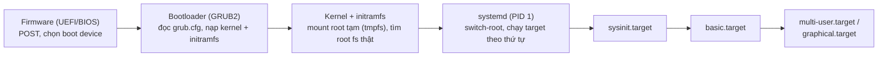

## 1. Vì sao cần biết

Một tình huống căng thẳng với System Engineer: server vừa reboot (sau update kernel, mất điện,
hoặc đổi cấu hình) và không SSH vào được. Câu hỏi đầu tiên luôn là: **máy đang kẹt ở giai đoạn
nào của boot?** — câu trả lời quyết định hướng xử lý hoàn toàn khác nhau:

- Kẹt ở màn hình firmware/POST → vấn đề phần cứng, không liên quan OS.
- Rơi vào `grub rescue>` → bootloader hỏng hoặc không tìm thấy kernel/initramfs.
- Kernel panic trước khi thấy log hệ thống → thường initramfs thiếu driver hoặc root
  filesystem không mount được.
- Máy "treo" lâu ở dòng `A start job is running for ...` → đã qua kernel, systemd đang khởi
  động service, một service cụ thể đang block.

Không nắm trình tự boot rất dễ debug sai hướng — ví dụ ngồi cả buổi kiểm tra network trong khi
máy còn chưa qua được GRUB. Bài này xây khung tư duy "biết mình đang ở đâu" trước khi đi vào
từng thành phần riêng (systemd ở các bài sau trong module này).

## 2. Khái niệm cốt lõi

Boot một máy Linux hiện đại (firmware UEFI + GRUB2 + systemd) đi qua 4 giai đoạn lớn, mỗi giai
đoạn trao quyền điều khiển cho giai đoạn sau:



- **Firmware (UEFI/BIOS)**: POST kiểm tra phần cứng, đọc cấu hình boot (UEFI: entry trong
  NVRAM trỏ tới file `.efi` trên phân vùng ESP) rồi trao quyền cho bootloader.
- **Bootloader (GRUB2)**: đọc `grub.cfg`, hiển thị menu chọn kernel, nạp `vmlinuz-*` +
  `initrd.img-*` từ `/boot` vào RAM, truyền kernel command line, chuyển quyền cho kernel.
- **Kernel + initramfs**: kernel giải nén và chạy initramfs như root filesystem tạm trong
  `tmpfs`, chứa đủ driver để tìm và mount root THẬT (theo UUID trong kernel command line), rồi
  `switch-root` sang đó.
- **systemd (PID 1)**: sau switch-root, kernel thực thi `systemd` làm init đầu tiên. systemd
  dựng đồ thị phụ thuộc, khởi động target theo thứ tự có kiểm soát nhưng song song tối đa:
  `sysinit.target` → `basic.target` → `multi-user.target`/`graphical.target` (tuỳ
  `default.target`, xem bài tiếp theo trong module này).

## 3. Cách nó hoạt động

Vài chi tiết kỹ ở từng giai đoạn giúp suy luận được khi gặp lỗi lạ:

**UEFI vs BIOS legacy**: BIOS legacy đọc 512 byte đầu đĩa (MBR) để tìm bootloader, không hiểu
filesystem. UEFI đọc trực tiếp một file `.efi` nằm trên phân vùng FAT32 (ESP), lưu danh sách
boot entry trong NVRAM của bo mạch chủ — đây là lý do `efibootmgr` thao tác NVRAM, không thao
tác đĩa. Máy viết bài này dùng UEFI (xác nhận ở mục 4).

**GRUB2 chỉ truyền hộ kernel command line, không "hiểu" nó**: tham số như `root=UUID=...`,
`quiet`, `splash` nằm trong `grub.cfg` (do `update-grub` sinh từ `/etc/default/grub`), GRUB chỉ
nạp chúng vào vùng nhớ cùng kernel. Kernel đọc lại qua `/proc/cmdline` (mục 4) — sửa sai một
tham số (ví dụ UUID root trỏ sai) khiến kernel không biết mount gì, dẫn tới kernel panic "VFS:
Unable to mount root fs" (mục 5).

**Vì sao cần initramfs làm bước trung gian**: lúc GRUB nạp kernel, kernel chưa load driver nào
(chưa biết đọc LVM, RAID, hay driver storage đặc thù). initramfs là filesystem nhỏ nạp thẳng
vào RAM, chứa sẵn driver/script cần để kernel "nhìn thấy" root thật (ví dụ driver NVMe, hoặc
LVM/`cryptsetup` nếu root mã hoá). Mount xong, `initrd-switch-root.service` thực hiện
`switch_root()` sang root thật rồi mới `exec` systemd. Đây là lý do sau khi đổi driver storage,
nhiều distro yêu cầu chạy `update-initramfs`/`dracut` — không làm vậy, initramfs cũ thiếu
driver mới, kernel không tìm thấy root ở lần boot kế tiếp.

**systemd nhận quyền ở PID 1, không tuần tự như init cũ (SysV)**: systemd dựng đồ thị phụ
thuộc giữa các unit (`After=`/`Before=`/`Requires=`/`Wants=` — chi tiết ở bài tiếp theo trong
module này) và khởi động song song tối đa, miễn đúng thứ tự ràng buộc. Vì vậy thứ tự log boot
**không cố định tuyệt đối** giữa các lần boot — khác biệt quan trọng so với init cũ, và lý do
`systemd-analyze blame`/`critical-chain` là công cụ đúng để tìm unit làm chậm boot, thay vì đọc
log theo thứ tự thời gian một cách máy móc.

## 4. Thực hành

Các lệnh dưới đây chạy thật trên máy Ubuntu 22.04.5 LTS (không dùng Docker vì máy đã có
systemd PID 1 sẵn; lưu ý server production có thể khác nếu dùng LVM riêng cho `/boot` hoặc
RHEL-family cấu trúc `/boot/efi` khác).

Kiểm tra máy boot UEFI hay BIOS legacy:

```bash
$ [ -d /sys/firmware/efi ] && echo "UEFI boot" || echo "Legacy BIOS boot"
UEFI boot
```

Xem tham số kernel command line mà GRUB đã truyền cho kernel (đọc lại được qua `/proc/cmdline`,
đúng như mô tả ở mục 3):

```bash
$ cat /proc/cmdline
BOOT_IMAGE=/boot/vmlinuz-6.8.0-138-generic root=UUID=8a0841cb-cba3-4358-b93b-944530672494 ro quiet splash vt.handoff=7
```

Đọc được: kernel đang chạy là `vmlinuz-6.8.0-138-generic`, root xác định qua UUID (không qua
`/dev/sdaX` — khuyến nghị vì tên thiết bị có thể đổi giữa các lần boot, UUID thì không), mount
`ro` ở bước đầu rồi systemd mới remount `rw` sau.

Xem các file liên quan tới kernel/initramfs hiện có trong `/boot` (rút gọn, bỏ các dòng không
liên quan bằng `...`):

```bash
$ ls -la /boot
...
-rw-r--r-- 1 root root 14.3M  vmlinuz-6.8.0-136-generic
-rw-r--r-- 1 root root 77.4M  initrd.img-6.8.0-136-generic
-rw-r--r-- 1 root root 14.3M  vmlinuz-6.8.0-138-generic
-rw-r--r-- 1 root root 77.4M  initrd.img-6.8.0-138-generic
lrwxrwxrwx 1 root root   25   vmlinuz -> vmlinuz-6.8.0-138-generic
lrwxrwxrwx 1 root root   28   initrd.img -> initrd.img-6.8.0-138-generic
...
```

Hai cặp kernel/initramfs cùng tồn tại (bản `136` và `138`), và symlink `vmlinuz`/`initrd.img`
luôn trỏ tới cặp MỚI NHẤT — distro giữ lại kernel cũ như phương án dự phòng, chọn bản cũ ở menu
GRUB để quay lại nếu kernel mới không boot được.

Xem target nào được chọn làm đích cuối của quá trình boot (tương đương "runlevel" cũ):

```bash
$ systemctl get-default
graphical.target
```

Trên server không có GUI, giá trị này thường là `multi-user.target`.

## 5. Lỗi thường gặp và cách chẩn đoán

**Rơi vào `grub rescue>` ngay sau khi khởi động**
- Nguyên nhân: GRUB không tìm thấy `grub.cfg` hoặc không định vị được phân vùng chứa nó —
  thường do bảng phân vùng bị thay đổi, hoặc firmware boot nhầm đĩa khác.
- Cách xác nhận: tại dấu nhắc, dùng `ls` liệt kê phân vùng GRUB thấy được, `set` xem biến môi
  trường GRUB đang trỏ tới đâu.
- Cách xử lý: boot từ live USB cùng distro, chroot vào hệ thống, chạy lại
  `grub-install <thiết-bị>` rồi `update-grub`.

**Kernel panic "VFS: Unable to mount root fs on unknown-block(0,0)"**
- Nguyên nhân phổ biến nhất: UUID root trong kernel command line (mục 4) không khớp UUID thật
  (ví dụ sau khi format lại đĩa), hoặc initramfs thiếu driver cần để thấy thiết bị root (đổi
  sang NVMe hoặc thêm RAID).
- Cách xác nhận: boot bằng kernel cũ — qua được thì khả năng cao initramfs kernel mới thiếu
  driver; kernel cũ cũng lỗi thì khả năng cao UUID/filesystem thật đã đổi.
- Cách xử lý: chroot từ live USB, `blkid` lấy UUID thật, sửa `/etc/default/grub` hoặc
  `/etc/fstab` rồi `update-grub`; thiếu driver thì `update-initramfs -u` (Debian/Ubuntu) hoặc
  `dracut -f` (RHEL-family).

**Treo rất lâu ở dòng `A start job is running for ...`**
- Nguyên nhân: một unit (thường `.mount` cho NFS/CIFS, hoặc `network-online.target`) đang chờ
  hết timeout vì tài nguyên nó cần (share, DHCP) chưa sẵn sàng.
- Cách xác nhận: `systemd-analyze blame` xếp hạng unit theo thời gian khởi động;
  `systemctl list-jobs` lúc đang boot xem job nào "running".
- Cách xử lý: thêm `nofail`/`x-systemd.device-timeout=` vào dòng mount network share trong
  `/etc/fstab`; hoặc sửa service phụ thuộc sai vào `network-online.target` khi không cần.

## 6. Tình huống thực tế

Một server nội bộ vừa được patch kernel qua trình quản lý gói rồi reboot theo lịch bảo trì.
Sau 15 phút không SSH vào được. Qua console quản lý (iDRAC/iLO), bạn thấy máy đang dừng ở dòng:

```
[  OK  ] Started Journal Service.
         Mounting /mnt/backup-nfs...
```

và không tiến thêm dù đã chờ thêm vài phút. Quy trình chẩn đoán:

1. Loại ngay khả năng lỗi GRUB/kernel panic — máy đã qua cả hai giai đoạn đó ("Started Journal
   Service" là log thật của systemd).
2. Dòng "Mounting /mnt/backup-nfs..." cho biết đang chờ một `.mount` unit ứng với một dòng NFS
   trong `/etc/fstab` — khớp mẫu "treo ở start job" ở mục 5.
3. Giả thuyết: NAS backup đích đang down hoặc đổi IP sau một thay đổi hạ tầng gần đây, khiến
   mount không bao giờ thành công và cũng không có timeout tường minh (`nofail` vắng mặt) —
   systemd mặc định chờ khá lâu trước khi coi là thất bại, và vì thiếu `nofail`, `local-fs.target`
   (nhiều service khác phụ thuộc gián tiếp) coi mount này là điều kiện bắt buộc, chặn boot vô
   hạn thay vì bỏ qua.
4. Xử lý tạm thời: chờ systemd timeout tự nhiên hoặc hủy job mount qua emergency shell ở
   console để boot tiếp tục; xử lý gốc: thêm `nofail,x-systemd.device-timeout=10` vào dòng
   mount NFS trong `/etc/fstab`, điều tra vì sao NAS không còn phản hồi đúng địa chỉ cũ.
5. Ghi vào runbook: mọi mount filesystem từ xa (NFS/CIFS) trong `/etc/fstab` của server
   production PHẢI có `nofail` trừ khi có lý do rõ ràng cần chặn boot khi thiếu nó.

## 7. Tự kiểm tra

1. Máy của bạn boot bằng UEFI, bạn vừa thay ổ cứng chứa root filesystem bằng một ổ mới và
   restore dữ liệu từ backup, nhưng không update lại GRUB. Khả năng cao nhất xảy ra ở lần boot
   kế tiếp là gì, và tại sao?
   <details><summary>Đáp án</summary>Khả năng cao là kernel panic "Unable to mount root fs" hoặc
   GRUB không tìm thấy kernel, vì entry UEFI trong NVRAM và/hoặc UUID root ghi trong
   `grub.cfg`/kernel command line vẫn trỏ tới ổ cũ (hoặc UUID cũ nếu ổ mới được format lại với
   UUID khác) — thiết bị vật lý thay đổi nhưng cấu hình bootloader không tự cập nhật theo.
   </details>

2. Vì sao kernel cần một initramfs trung gian thay vì mount trực tiếp root filesystem thật
   ngay khi GRUB nạp xong kernel?
   <details><summary>Đáp án</summary>Vì lúc đó kernel chưa load driver/module nào cho thiết bị
   storage cụ thể (NVMe, RAID, LVM, mã hoá...) — initramfs là filesystem tạm trong RAM chứa sẵn
   đúng driver/script cần thiết để kernel "nhìn thấy" và mount được root thật, trước khi
   switch-root sang đó.</details>

3. Bạn thấy log boot của server A và server B (cùng hardware, cùng OS) in ra các dòng unit
   khởi động theo thứ tự khác nhau giữa hai lần reboot của CÙNG MỘT server A. Đây có phải dấu
   hiệu lỗi cấu hình không?
   <details><summary>Đáp án</summary>Không nhất thiết. systemd khởi động unit song song tối đa,
   chỉ đảm bảo thứ tự ràng buộc bởi `After=`/`Before=`, không đảm bảo thứ tự tuyệt đối giữa các
   unit không phụ thuộc trực tiếp — thứ tự log khác nhau giữa các lần boot vẫn hoàn toàn bình
   thường.</details>

4. Lệnh nào cho biết chính xác những unit nào chiếm nhiều thời gian nhất trong lần boot gần
   nhất, và dùng khi nào thì hợp lý hơn so với đọc `journalctl -b` theo thứ tự thời gian?
   <details><summary>Đáp án</summary><code>systemd-analyze blame</code> (và
   <code>systemd-analyze critical-chain</code> để thấy chuỗi phụ thuộc găng). Hợp lý hơn khi
   mục tiêu là tìm unit LÀM CHẬM boot (cần xếp hạng theo thời gian), còn đọc
   <code>journalctl -b</code> theo thời gian phù hợp hơn khi cần tái hiện đúng trình tự sự kiện
   để tìm lỗi logic (unit nào fail trước, unit nào phụ thuộc bị ảnh hưởng theo).</details>

5. Một dòng NFS mount trong `/etc/fstab` không có tuỳ chọn `nofail`. Server backup đích đang
   offline. Điều gì xảy ra với quá trình boot, và cách phòng tránh cho lần sau?
   <details><summary>Đáp án</summary>Boot bị chặn (hoặc kéo dài rồi rơi vào emergency shell) vì
   systemd coi mount đó là điều kiện cần cho `local-fs.target`. Phòng tránh: luôn thêm
   <code>nofail</code> (và cân nhắc <code>x-systemd.device-timeout=</code>) cho mọi mount tới
   hệ thống ở xa, trừ khi có lý do rõ ràng muốn chặn boot khi thiếu nó.</details>

## 8. Bài liên quan và nguồn tham khảo

**Bài liên quan trong module này:**
- `linux.boot-systemd.units` — systemd: unit, service, target cơ bản (bước tiếp theo sau khi
  hiểu quy trình boot tổng quát ở bài này).
- `linux.boot-systemd.advanced` — dependency, target, socket activation chi tiết hơn.

**Nguồn tham khảo:**
- [bootup(7) — man7.org](https://man7.org/linux/man-pages/man7/bootup.7.html) — tài liệu chính
  thức mô tả trình tự boot-up của systemd, thứ tự target.
- [Rocky Linux Docs — System Startup](https://docs.rockylinux.org/10/books/admin_guide/10-boot/)
  — tổng quan các giai đoạn firmware/MBR/GRUB2/kernel/systemd, dùng để đối chiếu phần
  firmware/bootloader.
