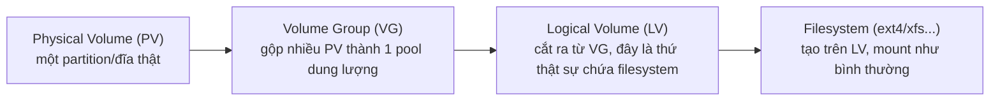

> **Lưu ý về cách viết bài này:** tương tự bài `partitioning`, tạo LVM là thao tác có thể làm
> mất dữ liệu nếu chạy nhầm thiết bị, và máy dùng để viết bài này không cài sẵn `lvm2` (quyết
> định của chủ dự án: không cài thêm gói/dùng sudo cho module này). Lệnh và output dưới đây lấy
> cú pháp đúng từ man page chính thức (`pvcreate(8)`, `vgcreate(8)`, và tài liệu `lvcreate`),
> đánh dấu **output minh hoạ** — tự kiểm chứng trên VM/máy test trước khi dùng thật.

## 1. Vì sao cần biết

Partition cố định (bài trước) có một nhược điểm lớn: đã tạo kích thước nào thì gần như "đóng
băng" kích thước đó trừ khi còn khoảng trống liền kề. LVM (Logical Volume Manager) giải quyết
vấn đề này bằng một lớp trừu tượng giữa đĩa vật lý và filesystem — cho phép mở rộng (và trong
nhiều trường hợp cả shrink) dung lượng MÀ KHÔNG CẦN unmount hay di chuyển dữ liệu thủ công, và
cho phép gộp nhiều đĩa vật lý thành MỘT không gian lưu trữ logic duy nhất. Đây là lý do gần như
mọi hệ thống Linux production dùng LVM thay vì partition trần cho phần dữ liệu (không phải
`/boot`, nơi bootloader cần đọc trực tiếp không qua LVM).

## 2. Khái niệm cốt lõi

LVM có 3 lớp trừu tượng, xếp chồng lên nhau:



| Lớp | Lệnh tạo | Vai trò |
|---|---|---|
| PV (Physical Volume) | `pvcreate` | Đánh dấu một partition/đĩa "thuộc về LVM" |
| VG (Volume Group) | `vgcreate` | Gộp một hoặc nhiều PV thành MỘT pool dung lượng chung |
| LV (Logical Volume) | `lvcreate` | Cắt ra một phần dung lượng từ VG, đây là thứ được format filesystem và mount |

## 3. Cách nó hoạt động

**VG là nơi "dung lượng thật sự được chia sẻ"**: khi gộp 2 đĩa 1TB vào một VG, VG đó có tổng
2TB khả dụng — các LV cắt ra từ VG này KHÔNG bị giới hạn bởi ranh giới đĩa vật lý ban đầu, một
LV có thể "trải" dữ liệu qua nhiều PV khác nhau trong cùng VG một cách trong suốt với filesystem
bên trên (filesystem không biết, và không cần biết, dữ liệu của nó nằm trên 1 hay nhiều đĩa
vật lý).

**Mở rộng LV dễ hơn nhiều so với mở rộng partition trần, nhưng vẫn cần resize filesystem sau
đó**: tăng kích thước LV (`lvextend`) chỉ thay đổi "LV này được cấp phát bao nhiêu không gian
trong VG" — bản thân filesystem bên trong (ext4, xfs...) không TỰ ĐỘNG biết dùng thêm không
gian mới trừ khi được resize riêng (`resize2fs` cho ext4, `xfs_growfs` cho XFS). `lvextend` hỗ
trợ cờ `-r`/`--resizefs` để làm CẢ HAI bước (mở rộng LV + resize filesystem) trong một lệnh,
tránh quên bước thứ hai — một lỗi rất phổ biến khi làm thủ công từng bước.

**VG cần ÍT NHẤT MỘT PV còn trống để `lvcreate`/`lvextend` thành công**: nếu toàn bộ PV trong
VG đã được cấp hết cho các LV khác, cần thêm PV mới vào VG (`vgextend`) trước khi tạo/mở rộng
LV — đây là lý do khi hết dung lượng, bước đầu tiên không phải `lvcreate` ngay mà phải kiểm tra
`vgs`/`vgdisplay` xem VG còn `Free` không.

## 4. Thực hành (output minh hoạ theo tài liệu chính thức, CHƯA tự chạy thật trên máy)

Tạo PV trên một partition đã có từ bài trước (`/dev/sdc1`):

```bash
$ pvcreate /dev/sdc1
  Physical volume "/dev/sdc1" successfully created.
```

Tạo VG gộp PV đó (có thể truyền nhiều PV cùng lúc nếu gộp nhiều đĩa):

```bash
$ vgcreate vg_data /dev/sdc1
  Volume group "vg_data" successfully created.
```

Tạo LV chiếm một phần dung lượng VG (ví dụ 500GB trong VG có tổng lớn hơn, để dành phần còn
lại cho nhu cầu sau này — đây là thực hành khuyến nghị thay vì cấp hết `100%FREE` ngay từ đầu):

```bash
$ lvcreate -L 500G -n lv_app vg_data
  Logical volume "lv_app" created.
```

Tạo filesystem và mount như một partition bình thường (LV xuất hiện dưới
`/dev/<tên-vg>/<tên-lv>`):

```bash
$ mkfs.ext4 /dev/vg_data/lv_app
$ mount /dev/vg_data/lv_app /mnt/app-data
```

Xem tổng quan 3 lớp vừa tạo (các lệnh liệt kê, an toàn, chỉ đọc):

```bash
$ pvs
  PV         VG      Fmt  Attr PSize  PFree
  /dev/sdc1  vg_data lvm2 a--  <1.00t  512.00g
$ vgs
  VG      #PV #LV #SN Attr   VSize  VFree
  vg_data   1   1   0 wz--n- <1.00t 512.00g
$ lvs
  LV     VG      Attr       LSize   Pool Origin Data%
  lv_app vg_data -wi-ao---- 500.00g
```

`PFree`/`VFree` = `512.00g` xác nhận còn dư dung lượng trong VG để tạo thêm LV khác hoặc mở
rộng `lv_app` sau này — đúng khớp với việc chỉ cấp `500G` trong tổng `~1TB` ở bước tạo LV.

## 5. Lỗi thường gặp và cách chẩn đoán

**`vgcreate`/`pvcreate` báo lỗi "device is already in use" hoặc tương tự**
- Nguyên nhân: thiết bị đã được mount, đang là một phần của RAID/LVM khác, hoặc còn chứa
  filesystem cũ mà kernel coi là "đang dùng".
- Cách xác nhận: `lsblk -f` xem thiết bị có đang mount hoặc có FSTYPE cũ không;
  `wipefs -n /dev/sdX` xem dấu vết filesystem/LVM/RAID cũ còn sót lại (chỉ xem, không xoá, nhờ
  cờ `-n`).
- Cách xử lý: `umount` nếu đang mount; `wipefs -a /dev/sdX` để xoá sạch dấu vết cũ (CẨN THẬN —
  đây là lệnh phá huỷ dữ liệu, chỉ chạy khi chắc chắn không còn cần dữ liệu cũ trên thiết bị).

**`lvextend` xong, `df -h` vẫn báo dung lượng cũ, chưa thấy tăng**
- Nguyên nhân: quên resize filesystem sau khi mở rộng LV (như giải thích ở mục 3) — đây là lỗi
  RẤT phổ biến khi làm thủ công từng bước thay vì dùng cờ `-r`.
- Cách xác nhận: `lvs` cho thấy LV đã tăng kích thước đúng, nhưng `df -h` trên mount point đó
  vẫn hiện dung lượng cũ.
- Cách xử lý: chạy riêng `resize2fs /dev/vg/lv` (ext2/3/4) hoặc `xfs_growfs <mount-point>`
  (XFS, lưu ý XFS dùng mount point, không dùng tên thiết bị) để filesystem nhận biết không gian
  mới; lần sau ưu tiên dùng `lvextend -r` để gộp cả hai bước.

**VG còn "Free" theo `vgs` nhưng `lvcreate`/`lvextend` vẫn báo không đủ dung lượng**
- Nguyên nhân phổ biến: nhầm đơn vị (`G` vs `g`, hoặc hiểu sai `%FREE` tính trên tổng VG hay
  trên phần free hiện tại), hoặc có LV khác đang giữ snapshot chiếm thêm không gian dự phòng.
- Cách xác nhận: `vgs -o +vg_free_count` hoặc đọc kỹ đơn vị trong output `vgdisplay` (phân biệt
  GiB thực tế vs cách làm tròn hiển thị).
- Cách xử lý: tính lại chính xác dung lượng cần, cân nhắc xoá bớt snapshot không cần thiết nếu
  đó là nguyên nhân chiếm dụng.

## 6. Tình huống thực tế

Một database server dùng LV riêng cho `/var/lib/postgresql` (`lv_pgdata`, 200GB trong VG
`vg_db` tổng 500GB), dung lượng dùng tăng dần và cảnh báo giám sát báo `df` sắp đầy ở 90%.

1. `vgs vg_db` — xác nhận VG còn `VFree = 300.00g`, đủ dư để mở rộng mà không cần thêm đĩa vật
   lý mới — đây là lợi thế chính của LVM so với partition trần (bài trước): nếu dùng partition
   trần, bước này sẽ phức tạp hơn nhiều (phải thêm đĩa mới, di chuyển dữ liệu, hoặc dùng
   `growpart` nếu còn khoảng trống liền kề sau partition).
2. Lên kế hoạch mở rộng thêm 100GB (giữ lại phần dư cho tương lai, không dùng hết `100%FREE`
   ngay — tránh phải lặp lại việc này quá thường xuyên nhưng cũng không chiếm hết dư địa VG).
3. Thực hiện trong MỘT lệnh để tránh quên bước resize filesystem (bài học từ mục 5):
   `lvextend -L +100G -r /dev/vg_db/lv_pgdata`.
4. Xác nhận: `df -h /var/lib/postgresql` cho thấy dung lượng tăng đúng 100GB ngay sau lệnh,
   không cần unmount database (LVM + hầu hết filesystem hiện đại hỗ trợ online resize cho thao
   tác MỞ RỘNG — khác với shrink, thường yêu cầu unmount và rủi ro hơn nhiều).
5. Cập nhật ngưỡng cảnh báo giám sát dựa trên dung lượng mới, theo dõi tốc độ tăng để ước tính
   khi nào cần mở rộng lần tiếp theo thay vì đợi cảnh báo khẩn cấp lần nữa.
6. Ghi vào runbook: mọi LV chứa dữ liệu quan trọng/tăng trưởng (database, log tập trung) nên
   được tạo ban đầu với VG còn dư địa rõ ràng (không cấp hết dung lượng đĩa vật lý ngay từ đầu
   cho một LV duy nhất), để các lần mở rộng sau chỉ là MỘT lệnh `lvextend -r`, không cần thêm
   đĩa vật lý mỗi lần.

## 7. Tự kiểm tra

1. Một VG gồm 2 PV, mỗi PV 1TB (tổng 2TB). Một LV có thể lớn hơn 1TB (dùng dữ liệu trải qua cả
   2 đĩa vật lý) không? Filesystem bên trên LV đó có cần biết dữ liệu nằm trên mấy đĩa không?
   <details><summary>Đáp án</summary>Có thể, lên tới gần 2TB (giới hạn bởi tổng VG, trừ phần
   đã cấp cho LV khác). Filesystem KHÔNG cần biết và không biết dữ liệu nằm trên 1 hay nhiều
   đĩa vật lý — đây chính là lớp trừu tượng LVM cung cấp, filesystem chỉ thấy một thiết bị khối
   logic duy nhất (<code>/dev/vg/lv</code>).</details>

2. Sau khi `lvextend -L +50G /dev/vg_data/lv_app` (KHÔNG dùng cờ `-r`), `df -h` trên mount
   point của LV đó có tự động hiện thêm 50GB không? Vì sao?
   <details><summary>Đáp án</summary>Không tự động. <code>lvextend</code> không có <code>-r</code>
   chỉ mở rộng LV (không gian cấp phát trong VG), filesystem bên trong (ext4/xfs...) không tự
   biết dùng thêm không gian mới — cần chạy riêng <code>resize2fs</code>/<code>xfs_growfs</code>,
   hoặc dùng cờ <code>-r</code> ngay từ đầu để gộp cả hai bước.</details>

3. `vgs` báo VG còn 300GB free, nhưng `lvcreate -L 300G` vẫn báo lỗi không đủ dung lượng. Hai
   hướng điều tra hợp lý nhất là gì?
   <details><summary>Đáp án</summary>(1) Kiểm tra lại đơn vị/cách làm tròn hiển thị (GiB thực tế
   có thể hơi khác số hiển thị gọn), thử yêu cầu dung lượng nhỏ hơn một chút; (2) kiểm tra có
   snapshot nào khác trong VG đang giữ thêm không gian dự phòng không (snapshot chiếm dụng
   không gian ngoài con số hiển thị đơn giản ở <code>vgs</code>).</details>

4. Vì sao hầu hết hệ thống Linux production dùng LVM cho phần dữ liệu thay vì partition trần,
   nhưng `/boot` thường VẪN là partition trần, không qua LVM?
   <details><summary>Đáp án</summary>LVM cho phép mở rộng/gộp dung lượng linh hoạt mà không cần
   di chuyển dữ liệu thủ công — lợi ích lớn cho phần dữ liệu thường xuyên thay đổi kích thước.
   <code>/boot</code> cần được BOOTLOADER đọc trực tiếp ở giai đoạn rất sớm (trước khi kernel
   và driver LVM được nạp) — nhiều bootloader không hỗ trợ đọc trực tiếp qua lớp LVM, nên
   <code>/boot</code> giữ nguyên dạng partition đơn giản để đảm bảo boot được.</details>

5. Thêm một đĩa vật lý mới vào một VG đã tồn tại (không tạo VG mới) dùng lệnh nào? Mục đích
   chính của việc này là gì?
   <details><summary>Đáp án</summary><code>vgextend &lt;tên-vg&gt; &lt;pv-mới&gt;</code> (sau
   khi đã <code>pvcreate</code> cho PV mới đó). Mục đích: tăng tổng dung lượng khả dụng của VG
   khi cần mở rộng LV nhưng VG hiện tại không còn đủ "Free" — thêm đĩa vật lý mới vào pool
   chung thay vì phải tạo VG/LV hoàn toàn riêng biệt.</details>

## 8. Bài liên quan và nguồn tham khảo

**Bài liên quan trong module này:**
- `linux.filesystem-storage.partitioning` — tạo partition dùng làm Physical Volume cho LVM.
- `linux.filesystem-storage.lvm-advanced` — resize/snapshot/thin provisioning, mở rộng sâu hơn
  các khái niệm `lvextend -r` đã giới thiệu ở bài này.

**Nguồn tham khảo:**
- [pvcreate(8) — man7.org](https://man7.org/linux/man-pages/man8/pvcreate.8.html) — cú pháp
  khởi tạo Physical Volume.
- [vgcreate(8) — man7.org](https://man7.org/linux/man-pages/man8/vgcreate.8.html) — cú pháp
  tạo Volume Group.
