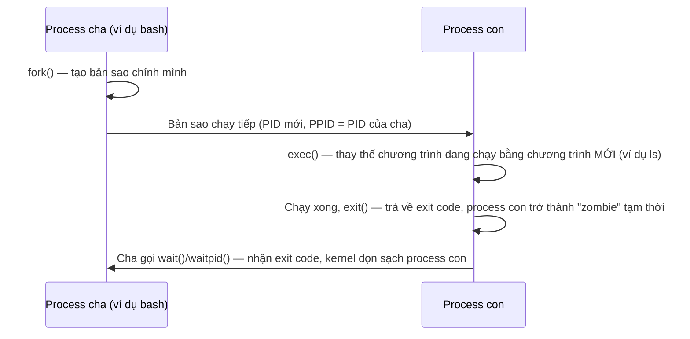

## 1. Vì sao cần biết

Lệnh `kill -9` không phản hồi, một process "biến mất" khỏi `ps` nhưng tài nguyên nó giữ (file
descriptor, port) vẫn chưa được giải phóng, hay một script khởi động xong "con" của nó rồi bản
thân script thoát — ba tình huống này đều quay về cùng một nền tảng: process trên Linux không
tự nhiên sinh ra độc lập, mà luôn được một process khác tạo ra (`fork`), rồi process đó chạy
chương trình khác (`exec`), và cuối cùng ai đó phải "nhận" kết quả khi nó kết thúc (`wait`).
Không hiểu đúng ba bước này, SE rất dễ nhầm lẫn giữa process "đã chết" và "đã được dọn dẹp" —
hai khái niệm khác nhau, dẫn thẳng tới hiện tượng zombie process ở bài cuối module này.

## 2. Khái niệm cốt lõi

Mọi process trên Linux (trừ process đầu tiên, PID 1) đều được tạo ra theo đúng một khuôn:



- **`fork()`**: tạo ra một process con là BẢN SAO gần như hoàn chỉnh của process cha (cùng bộ
  nhớ tại thời điểm đó, cùng file descriptor đang mở) — con có PID riêng, nhưng `PPID` (Parent
  PID) trỏ về cha.
- **`exec()`** (họ hàm `execve`, `execvp`...): process con THAY THẾ hoàn toàn chương trình
  đang chạy trong chính nó bằng một chương trình khác, giữ nguyên PID. Đây là lý do một shell
  (ví dụ `bash`) có thể "biến" process con vừa fork ra thành bất kỳ lệnh nào người dùng gõ
  (`ls`, `grep`...) mà không cần tạo process thứ ba.
- **`wait()`/`waitpid()`**: khi process con `exit()`, nó không biến mất ngay — kernel giữ lại
  một lượng thông tin tối thiểu (PID, exit code) để process CHA có thể đọc được kết quả. Cha
  phải chủ động gọi `wait()` để "nhận" thông tin này; sau đó kernel mới thực sự dọn sạch mọi
  vết của process con.
- **Trạng thái process** (xem đầy đủ hơn ở bài `linux.process-signals.monitoring`): một process
  tại một thời điểm luôn ở một trong các trạng thái chính — `R` (running/runnable), `S` (sleep
  có thể bị gián đoạn — đang chờ một sự kiện), `D` (sleep KHÔNG thể gián đoạn — thường đang chờ
  I/O), `T` (bị dừng bởi tín hiệu job control), `Z` (zombie — đã `exit()` nhưng cha chưa
  `wait()`).

## 3. Cách nó hoạt động

**Vì sao tách `fork` và `exec` làm hai bước riêng, không gộp làm một**: đây là thiết kế đặc
trưng của Unix (khác Windows, nơi tạo process mới thường là một lệnh gộp). Tách riêng cho phép
process con làm một số việc (ví dụ đổi working directory, đóng/mở lại file descriptor, đổi
user/group) NGAY SAU `fork` nhưng TRƯỚC `exec` — chính kỹ thuật này là nền tảng để shell làm
redirect (`>`, `<`) hay pipe (`|`): shell `fork` ra con, con tự sắp xếp lại file descriptor của
NÓ (không ảnh hưởng tới shell cha), rồi mới `exec` chương trình đích — chương trình đích không
cần biết gì về cách output của nó bị redirect, mọi thứ đã được chuẩn bị sẵn trước khi nó chạy.

**Zombie không phải "process bị treo", nó đã CHẾT, chỉ chưa được dọn**: phân biệt quan trọng —
`D` (uninterruptible sleep) là process còn SỐNG, đang chờ I/O, có thể trông "treo" nhưng vẫn
đang chạy; còn `Z` (zombie) là process đã `exit()` xong, không còn chạy gì, không chiếm CPU/RAM
thật (ngoài một mục nhỏ trong bảng process của kernel), chỉ đang "chờ" cha gọi `wait()`. Vì vậy
`kill -9` một zombie KHÔNG có tác dụng gì — nó đã chết, không có gì để kill; vấn đề thật nằm ở
process CHA không gọi `wait()` (xem chi tiết cách chẩn đoán ở bài
`linux.process-signals.zombie-orphan`).

**Nếu cha chết trước khi con kịp exit — ai nhận trách nhiệm "mồ côi"**: theo tài liệu chính
thức của `wait(2)`, nếu một process cha kết thúc mà còn con chưa `exit()`, các con đó được
"nhận nuôi" (re-parent) bởi `init(1)` hoặc process **subreaper** gần nhất — một cơ chế kernel
hỗ trợ để đảm bảo mọi process luôn có "cha" nào đó gọi `wait()` hộ khi nó kết thúc, tránh
zombie vĩnh viễn. Trên desktop Linux hiện đại dùng `systemd`, process nhận nuôi thường KHÔNG
phải PID 1 trực tiếp mà là `systemd --user` (instance systemd riêng cho mỗi session người
dùng, đóng vai trò subreaper) — xem minh hoạ thực tế ở mục 4.

## 4. Thực hành

Xem một process vừa tạo và quan hệ PPID (chạy trên máy Ubuntu 22.04.5 LTS thật, không qua
Docker):

```bash
$ tail -f /dev/null & echo "PID: $!"
PID: 30350
$ ps -p 30350 -o pid,ppid,stat,comm
    PID    PPID STAT COMMAND
  30350   30188 S    tail
```

`PPID=30188` chính là PID của shell (`bash`) đã `fork` ra process này — xác nhận đúng mô hình
ở mục 2: process con có PID riêng nhưng PPID trỏ về process đã tạo ra nó.

Minh hoạ "mồ côi" (orphan) thật: tạo process con trong một subshell riêng, để subshell đó thoát
NGAY (không `wait`), rồi xem process con "mồ côi" được ai nhận nuôi:

```bash
$ bash -c 'tail -f /dev/null & echo "child PID: $!"' 
child PID: 30370
$ ps -p 30370 -o pid,ppid,comm
    PID    PPID COMMAND
  30370    3466 tail
$ ps -p 3466 -o pid,ppid,comm,args
    PID    PPID COMMAND         COMMAND
   3466       1 systemd         /lib/systemd/systemd --user
```

Subshell (`bash -c '...'`) đã thoát ngay sau khi in PID, nhưng process `tail` vẫn sống —
`PPID` của nó đổi từ subshell đã chết sang `3466`, chính là instance `systemd --user` (bản
thân instance này là con của PID 1) — đúng khớp với khái niệm "subreaper" ở mục 3, không nhất
thiết phải là PID 1 trực tiếp trên một máy desktop dùng systemd user session.

Minh hoạ zombie thật (an toàn, tự dọn ngay trong cùng script bằng `waitpid`, không để lại
process rác):

```python
$ python3 -c "
import os, time
pid = os.fork()
if pid == 0:
    os._exit(0)
else:
    time.sleep(2)
    os.system(f'ps -o pid,ppid,stat,comm -p {pid}')
    os.waitpid(pid, 0)
    print('da reap xong (waitpid), zombie bien mat')
"
    PID    PPID STAT COMMAND
  30262   30261 Z    python3 <defunct>
da reap xong (waitpid), zombie bien mat
```

Cột `STAT=Z` và nhãn `<defunct>` xác nhận đúng trạng thái zombie trong khoảng 2 giây process
cha chủ động `sleep` trước khi gọi `waitpid()` — minh hoạ trực tiếp điều đã giải thích ở mục 3:
process đã chết (`exit(0)` ngay), chỉ đang chờ cha "nhận" kết quả.

## 5. Lỗi thường gặp và cách chẩn đoán

**`kill -9` một process đang ở trạng thái `Z` (zombie) không có tác dụng**
- Nguyên nhân: zombie đã kết thúc hoàn toàn, không còn gì để "kill" — nó chỉ là một bản ghi
  còn sót trong bảng process của kernel, chờ cha gọi `wait()`.
- Cách xác nhận: `ps -o pid,ppid,stat,comm -p <PID>` thấy `STAT=Z`.
- Cách xử lý: xử lý đúng chỗ là process CHA (`PPID`), không phải zombie — xem
  `linux.process-signals.zombie-orphan` để biết cách chẩn đoán và xử lý process cha không gọi
  `wait()` đúng cách.

**Tưởng `D` (uninterruptible sleep) giống `Z` (zombie) — cả hai đều "không phản hồi"**
- Nguyên nhân: nhầm lẫn phổ biến vì cả hai đều không dùng CPU và "đứng im" trong `ps`/`top`.
  Khác biệt căn bản: `D` vẫn là process SỐNG (thường đang chờ I/O từ disk/NFS phản hồi), `Z` là
  process đã CHẾT.
- Cách xác nhận: cột `STAT`/`S` trong `ps` — `D` khác `Z` rõ ràng; với `D`, `cat
  /proc/<PID>/stack` (cần quyền root) thường cho thấy process đang kẹt trong một syscall I/O cụ
  thể.
- Cách xử lý: process ở `D` không thể bị `kill` bằng tín hiệu thường (xem bài
  `linux.process-signals.signals`) vì nó không ở trạng thái nhận tín hiệu — phải giải quyết
  nguyên nhân I/O (ví dụ storage/NFS bị treo), không có cách "kill" tắt ngay process `D`.

**Script shell khởi động một process nền rồi thoát, tưởng process nền cũng bị dừng theo**
- Nguyên nhân: hiểu sai quan hệ cha-con — process con KHÔNG tự động bị kill khi cha thoát (trừ
  khi có cấu hình đặc biệt); nó chỉ đổi PPID sang subreaper như minh hoạ ở mục 4, tiếp tục chạy
  bình thường.
- Cách xác nhận: `ps -o pid,ppid,comm -p <PID>` sau khi script cha thoát — process con vẫn
  `Running`, chỉ `PPID` đã đổi.
- Cách xử lý: nếu ý định THỰC SỰ là dừng process con khi script thoát, phải tự quản lý (lưu PID,
  `trap EXIT` để `kill` con trước khi script kết thúc) — không thể trông chờ hành vi tự động.

## 6. Tình huống thực tế

Một server chạy một script giám sát tự viết, khởi động hàng loạt tiến trình `curl` kiểm tra
health-check theo chu kỳ. Sau vài tuần, admin nhận cảnh báo "process table gần đầy, không tạo
được process mới" (`fork: Resource temporarily unavailable`).

1. `ps aux | awk '$8 ~ /Z/ {print}' | wc -l` — phát hiện hàng nghìn process ở trạng thái `Z`.
2. `ps -eo stat,ppid,comm | awk '$1 ~ /Z/ {print $2}' | sort | uniq -c | sort -rn | head` — xem
   zombie đang "treo" dưới PPID nào nhiều nhất, phát hiện toàn bộ zombie đều có cùng một PPID:
   PID của script giám sát.
3. Đọc lại code script: nó dùng `subprocess.Popen(...)` để chạy `curl` nhưng không bao giờ gọi
   `.wait()`/`.poll()` để nhận kết quả sau khi `curl` đã chạy xong — mỗi lần health-check tạo
   một zombie mới, tích tụ dần qua nhiều tuần.
4. Xử lý tạm thời: restart script giám sát — khi process cha (script) bị kill, toàn bộ zombie
   con của nó được re-parent và reap ngay theo đúng cơ chế đã học ở mục 3 (subreaper tự
   `wait()` hộ).
5. Xử lý gốc: sửa code gọi `.wait()` (hoặc `.communicate()`) sau mỗi lần `Popen`, hoặc đổi sang
   dùng `subprocess.run()` (tự động wait, phù hợp hơn cho tác vụ ngắn như health-check).
6. Ghi vào runbook: mọi script tự tạo subprocess để chạy lệnh một lần (không phải daemon dài
   hạn) PHẢI gọi hàm wait tương đương của ngôn ngữ đang dùng — không có "garbage collector" nào
   tự làm việc này hộ ở cấp process.

## 7. Tự kiểm tra

1. Một chương trình C gọi `fork()` rồi gọi `exec()` ngay trong process con. Process con TRƯỚC
   khi gọi `exec()` có PID khác process cha không? Có cùng bộ nhớ với cha tại thời điểm đó
   không?
   <details><summary>Đáp án</summary>Có PID khác (mỗi process luôn có PID riêng ngay sau
   <code>fork()</code>). Có cùng bộ nhớ tại thời điểm fork (bản sao gần như hoàn chỉnh) —
   nhưng ngay khi <code>exec()</code> chạy, toàn bộ bộ nhớ đó bị thay thế hoàn toàn bằng
   chương trình mới, không còn liên quan gì tới bộ nhớ cũ của cha.</details>

2. Vì sao Unix tách `fork` và `exec` thành hai bước riêng thay vì gộp "tạo process mới chạy
   chương trình X" thành một lệnh?
   <details><summary>Đáp án</summary>Để process con có thể tự chỉnh sửa môi trường của chính
   nó (redirect file descriptor, đổi user/group, đổi working directory...) NGAY SAU
   <code>fork</code> nhưng TRƯỚC <code>exec</code>, mà không ảnh hưởng tới process cha. Đây là
   nền tảng để shell triển khai redirect/pipe mà chương trình đích không cần biết gì về việc
   đó.</details>

3. Một process ở trạng thái `D` (uninterruptible sleep) trong `ps` suốt 10 phút, không phản
   hồi `kill -9`. Đây có phải zombie không? Nên nghi ngờ nguyên nhân gì?
   <details><summary>Đáp án</summary>Không phải zombie — zombie (<code>Z</code>) là process ĐÃ
   CHẾT, còn <code>D</code> là process còn SỐNG, đang kẹt trong một syscall I/O không thể bị
   gián đoạn bởi tín hiệu (đây là lý do <code>kill -9</code> không có tác dụng). Nên nghi ngờ
   I/O bên dưới bị treo — ví dụ disk lỗi, hoặc mount NFS/CIFS tới server đã mất kết nối.</details>

4. Một script khởi động một process nền (`&`) rồi chính script thoát ngay sau đó, không `wait`
   cũng không `disown`. Process nền có bị dừng theo không? PPID của nó sau khi script thoát là
   gì?
   <details><summary>Đáp án</summary>Process nền KHÔNG tự bị dừng — nó tiếp tục chạy, được
   "nhận nuôi" (re-parent) bởi init hoặc subreaper gần nhất (ví dụ
   <code>systemd --user</code> trên một session desktop hiện đại), theo đúng cơ chế mô tả ở
   <code>wait(2)</code>.</details>

5. Vì sao một chương trình tạo rất nhiều subprocess ngắn hạn mà không bao giờ gọi hàm tương
   đương `wait()` có thể khiến CẢ SERVER không tạo được process mới nào, dù CPU/RAM còn dư rất
   nhiều?
   <details><summary>Đáp án</summary>Mỗi subprocess đã exit nhưng chưa được "wait" sẽ tồn đọng
   dưới dạng zombie, chiếm một slot trong bảng process (process table) của kernel — bảng này có
   giới hạn kích thước độc lập với CPU/RAM còn trống. Tích tụ đủ nhiều zombie sẽ làm đầy bảng
   process, khiến <code>fork()</code> cho bất kỳ chương trình nào trên máy đều thất bại, dù tài nguyên
   CPU/RAM vẫn còn dư.</details>

## 8. Bài liên quan và nguồn tham khảo

**Bài liên quan trong module này:**
- `linux.process-signals.signals` — cách gửi tín hiệu để kết thúc process đúng cách (khác với
  zombie — process vẫn SỐNG, cần tín hiệu để kết thúc).
- `linux.process-signals.monitoring` — đọc đầy đủ các cột trong `ps`/`top` để quan sát trạng
  thái process trong thực tế vận hành.
- `linux.process-signals.zombie-orphan` — chẩn đoán sâu hơn khi zombie tích tụ thật trên
  server production.

**Nguồn tham khảo:**
- [wait(2) — man7.org](https://man7.org/linux/man-pages/man2/wait.2.html) — định nghĩa chính
  thức về zombie, orphan, và vai trò của `init`/subreaper.
- [ps(1) — man7.org](https://man7.org/linux/man-pages/man1/ps.1.html) — ý nghĩa các mã trạng
  thái process trong cột `STAT`.
- [fork(2) — man7.org](https://man7.org/linux/man-pages/man2/fork.2.html) — xác nhận process
  con là bản sao bộ nhớ/file descriptor của cha, có PID riêng.
- [execve(2) — man7.org](https://man7.org/linux/man-pages/man2/execve.2.html) — cơ chế thay
  thế hoàn toàn chương trình đang chạy trong process, giữ nguyên PID.
