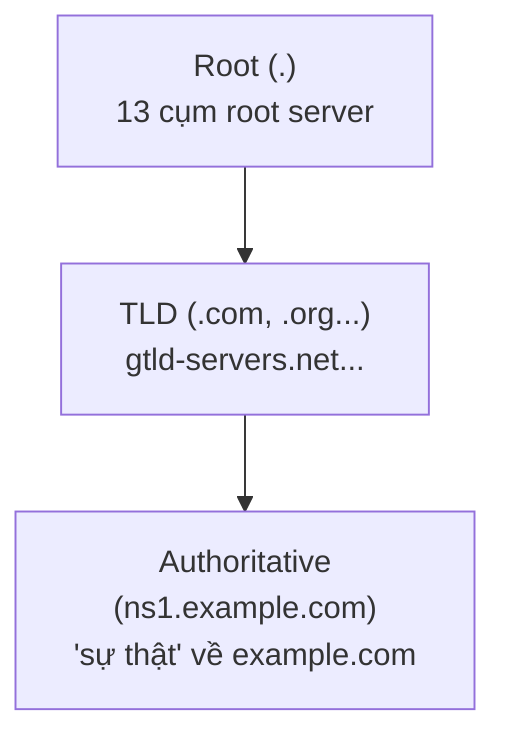

## 1. Vì sao cần biết

Phần lớn sự cố "không truy cập được dịch vụ" mà hoá ra không phải lỗi mạng, không phải lỗi
ứng dụng — mà là DNS trả sai, trả cũ, hoặc không trả gì. DNS là một hệ thống PHÂN CẤP, PHÂN
TÁN — không có "một server DNS trung tâm biết hết mọi domain". Hiểu đúng cấu trúc hierarchy
(root → TLD → authoritative) và vai trò khác nhau giữa resolver (máy mình hỏi) và authoritative
server (nơi "sự thật" về một domain nằm) là nền tảng để chẩn đoán đúng khi DNS "có vấn đề" —
một cụm từ quá mơ hồ nếu không biết hỏi tiếp "vấn đề ở ĐÂU trong chuỗi phân giải".

## 2. Khái niệm cốt lõi

DNS là một cây phân cấp (hierarchy), mỗi domain được "ủy quyền" (delegate) xuống cấp con:



Hai vai trò CẦN phân biệt rõ:

| Vai trò | Nhiệm vụ | Ví dụ |
|---|---|---|
| Resolver (recursive) | Nhận câu hỏi từ client, TỰ ĐI HỎI qua cả cây hierarchy để tìm câu trả lời | DNS của ISP, `8.8.8.8`, `127.0.0.53` (stub local) |
| Authoritative | GIỮ "sự thật" về một zone cụ thể, trả lời TRỰC TIẾP cho zone đó, không hỏi ai khác | `ns1.cloudflare.com` cho domain dùng Cloudflare DNS |

Các loại resource record (RR) phổ biến nhất:

| Loại | Vai trò |
|---|---|
| `A` | Tên miền → địa chỉ IPv4 |
| `AAAA` | Tên miền → địa chỉ IPv6 |
| `CNAME` | Tên miền → một tên miền KHÁC (alias) |
| `NS` | Domain này được quản lý bởi name server nào |
| `MX` | Mail server nhận email cho domain |
| `TXT` | Dữ liệu văn bản tùy ý (xác minh domain, SPF...) |
| `SOA` | Thông tin "chủ quyền" của zone (serial, refresh/retry/expire, TTL negative caching — chi tiết đủ 5 tham số ở bài `networking.dns.operations`) |

## 3. Cách nó hoạt động

**Resolver KHÔNG "biết" câu trả lời — nó ĐI HỎI thay bạn, từng bước xuống cây hierarchy**: khi
resolver nhận câu hỏi "IP của `example.com` là gì", nó KHÔNG có sẵn câu trả lời (trừ khi đã
cache từ trước) — nó hỏi ROOT server "ai quản lý `.com`", root trả lời tên TLD server; resolver
hỏi TLD server "ai quản lý `example.com`", TLD trả lời tên authoritative server; CUỐI CÙNG
resolver hỏi authoritative server đó câu hỏi gốc, nhận được record `A` thật. Quá trình này gọi
là "recursive resolution" — client chỉ gửi MỘT câu hỏi, resolver làm toàn bộ công việc "đi hỏi
nhiều vòng" thay cho client.

**Authoritative server không bao giờ "hỏi" ai khác — nó TRẢ LỜI NGAY từ dữ liệu nó giữ**: khác
với resolver, authoritative server cho một zone KHÔNG đi hỏi vòng nào — nó LÀ nguồn sự thật
cho zone đó. Nếu một authoritative server trả lời SAI (ví dụ cấu hình nhầm record), KHÔNG CÓ
NGUỒN NÀO KHÁC để "sửa" — mọi resolver trên thế giới sẽ nhận và lan truyền câu trả lời sai đó
(cho tới khi admin sửa đúng tại authoritative server và TTL cũ hết hạn).

**TTL (Time To Live) quyết định "câu trả lời cũ còn được tin bao lâu" — không phải thời gian
record đó có hiệu lực TRÊN authoritative server**: mỗi record có một giá trị TTL (giây) —
resolver CACHE câu trả lời đó trong đúng khoảng thời gian này, không hỏi lại authoritative
server cho tới khi TTL hết. Đây là lý do SAU KHI sửa một record trên authoritative server,
thay đổi KHÔNG lan ra ngay lập tức toàn thế giới — mọi resolver đã cache record CŨ vẫn trả lời
sai cho tới khi TTL của record cũ hết hạn, dù authoritative server đã đúng từ lâu.

## 4. Thực hành

Xem resolver đang được máy dùng — chú ý ĐÂY không phải DNS server thật, mà là STUB resolver
local (chạy thật trên Ubuntu 22.04.5 với systemd-resolved):

```bash
$ cat /etc/resolv.conf
nameserver 127.0.0.53
options edns0 trust-ad
search .
```

`resolvectl status` cho thấy stub `127.0.0.53` chỉ là lớp trung gian — DNS server THẬT (nơi
stub chuyển tiếp câu hỏi tới) nằm ở nơi khác:

```bash
$ resolvectl status
[...]
Link 2 (enp1s0)
[...]
Current DNS Server: 192.168.24.1
       DNS Servers: 192.168.24.1
```

(Output thật đầy đủ còn có khối `Global` và các dòng `Protocols:`/`Current Scopes:` khác —
cắt bớt ở đây, chỉ giữ 2 dòng quan trọng nhất cho mục đích minh hoạ.)

Xác nhận: mọi ứng dụng trên máy "hỏi" `127.0.0.53` (stub), nhưng stub đó THỰC SỰ chuyển tiếp
câu hỏi ra `192.168.24.1` (router/DNS nội bộ) — một kiến trúc 2 lớp phổ biến trên Linux hiện
đại (systemd-resolved), không phải lỗi hay cấu hình thừa.

Xem chuỗi resolution THẬT, từ root tới authoritative (`+trace`, minh hoạ nguyên lý mục 3 bằng
dữ liệu thật — đã RÚT GỌN, chỉ giữ 1 dòng tiêu biểu mỗi bước; output gốc của `+trace` dài hơn
nhiều, ví dụ bước ROOT trả về cả 13 root server, bước cuối trả về đủ 2 NS của `example.com`):

```bash
$ dig +trace +nodnssec example.com
[...13 root server...]
com.   172800 IN NS j.gtld-servers.net.
;; Received XXX bytes from ...(h.root-servers.net) in XX ms

[...13 NS của .com...]
example.com.  172800 IN NS elliott.ns.cloudflare.com.
example.com.  172800 IN NS hera.ns.cloudflare.com.
;; Received XXX bytes from ...(j.gtld-servers.net) in XX ms

example.com.  300 IN A 172.66.147.243
;; Received XXX bytes from ...(elliott.ns.cloudflare.com) in XX ms
```

Đọc đúng 3 bước: ROOT server trả lời "hỏi TLD server `j.gtld-servers.net` về `.com`" → TLD
server trả lời "hỏi authoritative `elliott.ns.cloudflare.com` về `example.com`" →
authoritative trả lời record `A` THẬT. Đây CHÍNH XÁC là quy trình đã mô tả ở mục 3, không phải
lý thuyết.

Xem các loại record khác nhau của cùng một domain thật:

```bash
$ dig +noall +answer NS google.com
google.com. 338540 IN NS ns1.google.com.
google.com. 338540 IN NS ns2.google.com.
$ dig +noall +answer MX google.com
google.com. 29 IN MX 10 smtp.google.com.
```

Chú ý TTL khác nhau RÕ RỆT giữa hai loại record của CÙNG domain: `NS` có TTL `338540` giây
(~4 ngày, ít thay đổi), `MX` có TTL chỉ `29` giây (thay đổi thường xuyên hơn) — mỗi record có
TTL RIÊNG, không phải một giá trị chung cho cả domain.

## 5. Lỗi thường gặp và cách chẩn đoán

**Sửa record DNS xong, một số người dùng vẫn thấy giá trị CŨ sau nhiều giờ**
- Nguyên nhân: TTL của record cũ chưa hết hạn ở các resolver đã cache nó trước đó — đúng hành
  vi thiết kế (mục 3), không phải lỗi truyền tải cấu hình.
- Cách xác nhận: `dig <domain>` trực tiếp tới authoritative server
  (`dig @ns1.example.com <domain>`) để thấy giá trị MỚI NHẤT thật, so sánh với TTL hiển thị
  khi hỏi resolver thường — nếu resolver trả TTL đang giảm dần từ giá trị cũ, xác nhận đang
  đọc từ cache.
- Cách xử lý: không có cách "ép" resolver của người dùng khác xoá cache ngay — chỉ có thể GIẢM
  TTL TRƯỚC một thay đổi quan trọng đã biết trước (ví dụ trước khi migrate server, hạ TTL
  xuống thấp vài giờ/ngày trước đó để thay đổi lan nhanh hơn khi thực hiện).

**Nhầm "DNS chậm" là lỗi mạng, không kiểm tra đúng tầng DNS**
- Nguyên nhân: không phân biệt được "không phân giải được domain" (lỗi DNS, tầng Application)
  với "phân giải được nhưng không kết nối được tới IP đó" (lỗi tầng khác, xem bài
  `networking.tcpip.osi-tcpip-model`).
- Cách xác nhận: `dig <domain>` trả về record `A` hợp lệ nhanh chóng → DNS ổn, vấn đề nằm ở
  tầng khác; `dig` timeout hoặc không trả lời → đúng là vấn đề DNS.
- Cách xử lý: luôn tách riêng bước "DNS có trả lời đúng/nhanh không" trước khi điều tra kết
  nối mạng tới IP đã phân giải.

**Domain mới mua, cấu hình NS xong nhưng vẫn không phân giải được sau nhiều ngày**
- Nguyên nhân phổ biến: chưa cập nhật đúng NS record ở REGISTRAR (nơi mua domain) để trỏ về
  authoritative server mới — registrar vẫn trỏ về NS cũ hoặc NS mặc định, TLD server vẫn chỉ
  đường tới authoritative SAI.
- Cách xác nhận: `dig NS <domain>` so sánh kết quả từ resolver thường với kết quả mong đợi —
  nếu khác, vấn đề nằm ở cấu hình registrar, không phải ở authoritative server mới.
- Cách xử lý: sửa đúng NS record tại registrar, chờ TTL của NS record cũ (thường khá dài, có
  thể 1-2 ngày) hết hạn hoàn toàn trên các resolver đã cache.

## 6. Tình huống thực tế

Team vừa migrate một service sang server mới, đã cập nhật record `A` của `api.example.com`
sang IP mới, nhưng 30 phút sau một số client vẫn kết nối tới server CŨ (đã tắt), gây lỗi.

1. `dig api.example.com` từ máy của team — thấy IP MỚI, đúng như mong đợi (xác nhận record đã
   sửa đúng trên authoritative server).
2. Yêu cầu một đồng nghiệp ở văn phòng khác chạy `dig api.example.com` — thấy IP CŨ. Xác nhận
   ngay: đây không phải lỗi cấu hình, mà là TTL cache (mục 3) — resolver khác nhau cache ở thời
   điểm khác nhau, chưa hết hạn đồng loạt.
3. Kiểm tra TTL đã đặt cho record này TRƯỚC migrate: `3600` giây (1 giờ) — khá hợp lý, nhưng
   team đã KHÔNG hạ TTL xuống thấp hơn TRƯỚC KHI migrate (ví dụ xuống `60` giây vài giờ trước),
   nên cache cũ (với TTL 1 giờ gốc) vẫn còn hiệu lực ở nhiều nơi.
4. Xử lý tạm thời: không có cách ép resolver bên ngoài xoá cache — chỉ có thể THÔNG BÁO rộng
   cho người dùng bị ảnh hưởng chờ thêm (tối đa tới khi hết TTL gốc, ở đây là tới 1 giờ sau khi
   sửa record).
5. Giữ server CŨ chạy thêm một khoảng thời gian AN TOÀN (ít nhất bằng TTL gốc, cộng biên) sau
   khi sửa DNS, KHÔNG tắt ngay — đây là sai lầm chính trong tình huống này (tắt server cũ quá
   sớm, trước khi TTL cache toàn cầu kịp hết hạn).
6. Ghi vào runbook: với mọi migrate cần đổi DNS, (a) hạ TTL xuống thấp (vài phút) ÍT NHẤT một
   khoảng TTL gốc TRƯỚC thời điểm migrate dự kiến; (b) sau khi đổi record, GIỮ server cũ sống
   thêm tối thiểu bằng TTL gốc (hoặc TTL đã hạ, cộng thêm biên an toàn) trước khi tắt hẳn.

## 7. Tự kiểm tra

1. Phân biệt resolver (recursive) và authoritative server — ai "tự đi hỏi", ai "trả lời ngay
   từ dữ liệu mình giữ"?
   <details><summary>Đáp án</summary>Resolver (recursive) TỰ ĐI HỎI qua nhiều bước (root → TLD
   → authoritative) để tìm câu trả lời, không có sẵn dữ liệu (trừ cache). Authoritative server
   TRẢ LỜI NGAY từ dữ liệu nó giữ cho zone đó, không hỏi ai khác.</details>

2. Một record DNS có TTL `300` giây. Sau khi admin sửa giá trị record đó trên authoritative
   server, một resolver ĐÃ cache giá trị cũ trước đó 100 giây. Resolver này sẽ trả giá trị gì
   nếu được hỏi NGAY bây giờ?
   <details><summary>Đáp án</summary>Giá trị CŨ (đã cache) — vì mới qua 100/300 giây, cache
   chưa hết hạn, resolver chưa hỏi lại authoritative server để lấy giá trị mới.</details>

3. `dig NS example.com` và `dig MX example.com` cho ra hai giá trị TTL khác nhau RẤT NHIỀU.
   Đây có phải lỗi cấu hình không?
   <details><summary>Đáp án</summary>Không. Mỗi LOẠI record có TTL RIÊNG, độc lập — hoàn toàn
   bình thường khi NS (ít đổi) có TTL dài còn MX (có thể đổi thường xuyên hơn) có TTL ngắn hơn
   nhiều cho cùng một domain.</details>

4. Trước khi migrate server và đổi IP trong record DNS, nên làm gì với TTL để giảm thời gian
   "một số người vẫn thấy IP cũ" sau khi migrate?
   <details><summary>Đáp án</summary>HẠ TTL xuống thấp (ví dụ vài phút) một khoảng thời gian
   TRƯỚC thời điểm migrate (ít nhất bằng TTL gốc, để cache cũ với TTL dài kịp hết hạn trước khi
   migrate thật diễn ra) — sau đó thay đổi mới sẽ lan nhanh hơn vì TTL mới ngắn.</details>

5. Vì sao không thể "ép" một resolver ở xa (ví dụ DNS của một ISP khác) xoá cache ngay lập tức
   sau khi sửa record trên authoritative server của mình?
   <details><summary>Đáp án</summary>Vì resolver đó hoàn toàn ĐỘC LẬP, không có cơ chế "thông
   báo" chủ động từ authoritative server tới mọi resolver đã cache — resolver chỉ tự hỏi lại
   khi TTL đã cache hết hạn. Người quản trị domain không có quyền kiểm soát hành vi cache của
   resolver bên thứ ba.</details>

## 8. Bài liên quan và nguồn tham khảo

**Bài liên quan trong module này:**
- `networking.dns.operations` — vận hành zone file, cấu hình TTL thực tế, công cụ chẩn đoán
  chi tiết hơn (`dig`/`nslookup`).

**Bài liên quan ngoài module:**
- `networking.tcpip.osi-tcpip-model` — DNS thuộc tầng Application, cần phân biệt với lỗi ở
  tầng khác.
- `linux.network-stack.dns-resolution` — góc nhìn cụ thể trên Linux (resolv.conf, nsswitch,
  systemd-resolved) mà bài này đã minh hoạ một phần.

**Nguồn tham khảo:**
- [RFC 1035](https://www.rfc-editor.org/rfc/rfc1035) — đặc tả chính thức DNS, định nghĩa các
  loại resource record.
- [resolv.conf(5) — man7.org](https://man7.org/linux/man-pages/man5/resolv.conf.5.html) — cấu
  hình resolver trên Linux.
