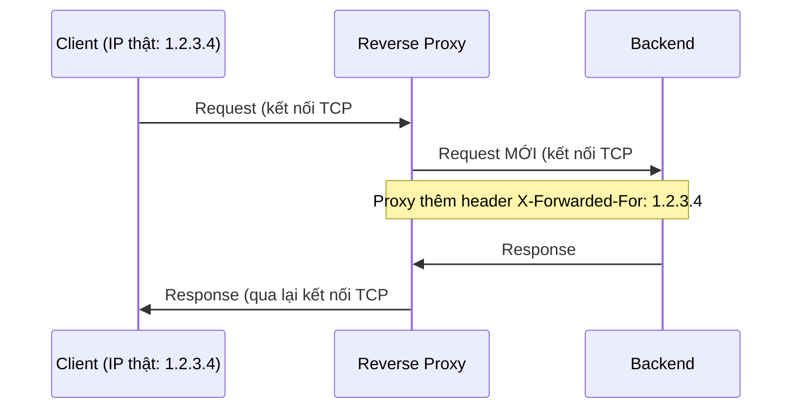

> **Lưu ý về cách viết bài này:** Nginx/HAProxy không có sẵn trên máy viết bài (không cài thêm
> gói ngoài phạm vi, theo đúng tiền lệ). Để minh hoạ CƠ CHẾ thật của reverse proxy mà không cần
> hai phần mềm đó, đã tự viết một proxy TỐI GIẢN bằng Python (`http.server` + `urllib`, ~20
> dòng) và một backend "echo" (tự in lại header nó nhận được) — chạy THẬT trên `127.0.0.1`,
> không phải giả lập. Cấu hình `nginx.conf`/HAProxy cụ thể trong bài đánh dấu **output minh
> hoạ** theo tài liệu chính thức; PHẢI tự kiểm chứng trên Nginx/HAProxy thật trước khi dùng.

## 1. Vì sao cần biết

Reverse proxy là lớp trung gian ĐỨNG TRƯỚC backend, nhận request từ client rồi TỰ chuyển tiếp
tới backend thật — gần như mọi hệ thống web production đều có ít nhất một lớp này (Nginx,
HAProxy, hoặc load balancer cloud). Hiểu đúng cơ chế giúp giải quyết hai câu hỏi hay gây nhầm
lẫn: "vì sao backend thấy IP khác với IP client thật?", và "log backend ghi gì khi có proxy ở
giữa?" — cả hai đều bắt nguồn từ việc proxy TẠO MỘT KẾT NỐI TCP MỚI tới backend, không phải
"chuyển tiếp" kết nối gốc của client.

## 2. Khái niệm cốt lõi



Hai công cụ phổ biến nhất:

| | Nginx | HAProxy |
|---|---|---|
| Vai trò chính | Web server + reverse proxy | Load balancer chuyên dụng |
| Cấu hình | `location`/`proxy_pass` | `frontend`/`backend` |
| Dùng phổ biến | Static file + proxy + TLS termination | Load balancing nâng cao, health check chi tiết |

## 3. Cách nó hoạt động

**Backend KHÔNG BAO GIỜ thấy IP thật của client nếu không có header `X-Forwarded-For`** — vì
proxy tạo kết nối TCP HOÀN TOÀN MỚI tới backend (minh hoạ ở sequence diagram), tại TẦNG TCP,
backend chỉ thấy source IP là IP CỦA PROXY, không phải IP client gốc. Để backend biết "client
thật là ai" (cần cho log, rate-limit theo IP, geo-blocking...), proxy PHẢI chủ động thêm header
`X-Forwarded-For` (chứa IP client gốc) vào request trước khi gửi tới backend — đây KHÔNG phải
hành vi tự động của TCP/IP, mà là QUY ƯỚC ứng dụng proxy phải tự làm.

**`X-Forwarded-For` có thể bị GIẢ MẠO nếu backend nhận request TRỰC TIẾP từ client (không qua
proxy tin cậy)** — đây là lỗ hổng bảo mật thực tế: client ÁC Ý có thể tự thêm header
`X-Forwarded-For: 1.1.1.1` (IP bất kỳ) vào request của họ nếu backend MỞ TRỰC TIẾP ra Internet
và tin tưởng mù quáng header này. Cấu hình ĐÚNG là: backend CHỈ nhận request từ ĐÚNG IP của
proxy tin cậy (firewall/security group — đã học ở module trước), và/hoặc proxy GHI ĐÈ (không
chỉ "thêm") header này để đảm bảo giá trị cuối cùng là IP THẬT nó thấy được qua kết nối TCP.

**Reverse proxy khác Forward proxy ở việc "AI đang được che giấu"**: reverse proxy che giấu
BACKEND (client không biết/không cần biết có bao nhiêu backend, IP thật của chúng) — client chỉ
thấy MỘT địa chỉ (của proxy). Forward proxy (không phải chủ đề bài này) che giấu CLIENT (server
đích không biết client thật là ai, chỉ thấy IP proxy) — hai mô hình ngược hướng, dễ nhầm tên vì
cùng chữ "proxy".

## 4. Thực hành

Demo CƠ CHẾ thật bằng proxy Python tối giản (20 dòng, dùng `http.server`+`urllib`, KHÔNG phải
Nginx/HAProxy — nhưng cùng nguyên lý: nhận request, tạo kết nối MỚI tới backend, thêm header,
trả response về). Backend là một "echo server" tự in lại header nó nhận được:

Gọi TRỰC TIẾP tới backend (không qua proxy) — xem backend thấy gì:

```bash
$ curl -s http://127.0.0.1:8001/orders
{
  "path": "/orders",
  "headers_received": {
    "Host": "127.0.0.1:8001",
    "User-Agent": "curl/7.81.0",
    "Accept": "*/*"
  },
  "client_address_seen_by_backend": "127.0.0.1"
}
```

Gọi QUA PROXY tới CÙNG backend, CÙNG request — so sánh trực tiếp:

```bash
$ curl -s http://127.0.0.1:8080/orders
{
  "path": "/orders",
  "headers_received": {
    "Host": "127.0.0.1:8001",
    "Accept-Encoding": "identity",
    "User-Agent": "Python-urllib/3.10",
    "X-Forwarded-For": "127.0.0.1",
    "X-Forwarded-Proto": "http",
    "X-Real-Ip": "127.0.0.1",
    "Connection": "close"
  },
  "client_address_seen_by_backend": "127.0.0.1"
}
```

Hai điểm THẬT quan trọng cần đọc kỹ (không phải lý thuyết, là dữ liệu vừa chạy): `User-Agent`
đổi từ `curl/7.81.0` thành `Python-urllib/3.10` — xác nhận TRỰC TIẾP rằng proxy đã tạo một
request HOÀN TOÀN MỚI (với User-Agent của chính thư viện proxy dùng để gọi backend, không phải
"chuyển tiếp" request gốc của client). Và backend CHỈ biết IP client thật (`127.0.0.1` ở đây,
vì test cùng máy — trên hệ thống thật sẽ là IP public của client) NHỜ header `X-Forwarded-For`
mà proxy tự thêm — nếu proxy không thêm header này, backend sẽ KHÔNG CÓ cách nào biết client
gốc là ai, dù `client_address_seen_by_backend` ở tầng TCP vẫn đúng là địa chỉ của PROXY trong
thực tế production (ở đây trùng `127.0.0.1` chỉ vì test trên cùng máy).

Xem response header do PROXY thêm vào (khác với response gốc của backend):

```bash
$ curl -s -D - http://127.0.0.1:8080/orders -o /dev/null
HTTP/1.0 200 OK
Content-Type: application/json
X-Proxied-By: tiny_proxy.py
```

Cấu hình Nginx tương đương cho CHÍNH xác những gì proxy Python ở trên làm — **output minh
hoạ**, theo đúng cú pháp chính thức:

```nginx
server {
    listen 8080;
    location / {
        proxy_pass http://127.0.0.1:8001;
        proxy_set_header X-Forwarded-For $remote_addr;
        proxy_set_header X-Forwarded-Proto $scheme;
        proxy_set_header X-Real-IP $remote_addr;
    }
}
```

## 5. Lỗi thường gặp và cách chẩn đoán

**Log backend ghi TOÀN BỘ request là từ MỘT IP (của proxy), không phân biệt được client thật**
- Nguyên nhân: backend tự log `request.remote_addr` (tầng TCP) thay vì đọc header
  `X-Forwarded-For` — đúng hiện tượng đã minh hoạ ở mục 4.
- Cách xác nhận: so sánh log backend với log của PROXY (proxy luôn thấy đúng IP client thật ở
  tầng TCP của chính nó).
- Cách xử lý: sửa code/framework backend đọc `X-Forwarded-For` (nhiều framework có cấu hình
  "trust proxy" sẵn) khi CHẮC CHẮN mọi request backend nhận đều qua đúng proxy tin cậy.

**Rate-limit theo IP không có tác dụng, mọi client tính chung thành MỘT IP**
- Nguyên nhân tương tự lỗi trên — logic rate-limit đọc sai nguồn IP (tầng TCP thay vì
  `X-Forwarded-For`), nên mọi client (khác IP thật) bị tính CHUNG vào một "IP" của proxy, dễ
  đạt ngưỡng limit dù mỗi client thật chưa vượt quá gì.
- Cách xác nhận: test với nhiều client/IP khác nhau qua proxy, thấy limit bị áp dụng CHUNG bất
  thường.
- Cách xử lý: sửa đúng nguồn đọc IP cho rate-limit, tương tự cách sửa log ở trên.

**Backend nhận `X-Forwarded-For` giả mạo vì mở trực tiếp ra Internet, không chỉ qua proxy**
- Nguyên nhân: thiếu kiểm soát mạng (firewall/security group) đảm bảo backend CHỈ nhận kết nối
  từ đúng IP của proxy — client ác ý có thể bỏ qua proxy, tự thêm header giả.
- Cách xác nhận: kiểm tra security group/firewall của backend có đang mở public không.
- Cách xử lý: giới hạn backend chỉ nhận traffic từ IP/subnet của proxy (đã học ở module
  `networking.nat-firewall`), và cấu hình proxy GHI ĐÈ (không chỉ thêm) header này.

## 6. Tình huống thực tế

Một ứng dụng e-commerce phát hiện cơ chế chống fraud (dựa trên IP) không hoạt động đúng — nhiều
đơn hàng gian lận từ các IP khác nhau đều bị hệ thống ghi nhận là "cùng một IP".

1. Kiểm tra log ứng dụng — xác nhận TOÀN BỘ request (hợp lệ và gian lận) đều ghi CÙNG một IP:
   chính IP của load balancer đứng trước ứng dụng.
2. Kiểm tra code ứng dụng — xác nhận đang đọc IP từ `request.remote_addr` (tầng TCP/framework
   mặc định), không đọc header `X-Forwarded-For` mà load balancer đã thêm.
3. Xác nhận load balancer CÓ thêm đúng header này (kiểm tra cấu hình, hoặc bắt gói giữa load
   balancer và ứng dụng) — xác nhận header tồn tại, chỉ là ứng dụng không đọc.
4. Sửa code đọc đúng `X-Forwarded-For` (hầu hết framework web có cấu hình sẵn kiểu
   "trust proxy headers", chỉ cần bật đúng và XÁC NHẬN đã giới hạn chỉ tin tưởng khi traffic
   thực sự qua đúng load balancer — tránh lỗ hổng giả mạo đã nói ở mục 3/5).
5. Deploy lại, test với nhiều IP khác nhau qua load balancer — xác nhận log/cơ chế chống fraud
   giờ phân biệt đúng từng IP client thật.
6. Ghi vào runbook: MỌI hệ thống có logic dựa trên IP client (rate-limit, chống fraud, geo-
   blocking, audit log) PHẢI xác nhận rõ có lớp proxy/load balancer ở trước không, và đọc IP
   từ ĐÚNG nguồn (`X-Forwarded-For` nếu có proxy, không mặc định dùng IP tầng TCP).

## 7. Tự kiểm tra

1. Một backend đứng sau reverse proxy ghi log mọi request đều từ IP `10.0.0.5` (IP của chính
   proxy). Đây có phải bug của backend không?
   <details><summary>Đáp án</summary>Không hẳn là bug, mà là THIẾU xử lý đúng — backend đang
   đọc IP ở tầng TCP (luôn là IP của proxy, vì proxy tạo kết nối mới), cần sửa để đọc từ header
   <code>X-Forwarded-For</code> mới thấy đúng IP client gốc.</details>

2. Vì sao không nên để backend tin tưởng TUYỆT ĐỐI vào header `X-Forwarded-For` nếu backend có
   thể nhận kết nối trực tiếp từ Internet (không chỉ qua proxy)?
   <details><summary>Đáp án</summary>Vì client ác ý có thể TỰ thêm header
   <code>X-Forwarded-For</code> với giá trị giả mạo bất kỳ trong request của họ — nếu backend
   mở trực tiếp ra Internet và tin mù quáng header này, kẻ tấn công có thể giả danh bất kỳ IP
   nào. Cần giới hạn backend chỉ nhận traffic từ đúng IP proxy tin cậy.</details>

3. Trong demo Python ở mục 4, `User-Agent` mà backend nhận được là `Python-urllib/3.10`, không
   phải `curl/7.81.0` của client gốc. Giải thích vì sao.
   <details><summary>Đáp án</summary>Vì proxy không "chuyển tiếp" request gốc nguyên văn — nó
   TẠO MỘT REQUEST MỚI HOÀN TOÀN tới backend bằng thư viện của chính nó
   (<code>urllib</code>), nên các header mặc định (như User-Agent) phản ánh thư viện/công cụ
   proxy dùng để gọi, không phải client gốc.</details>

4. Phân biệt Reverse Proxy và Forward Proxy dựa trên "ai đang được che giấu khỏi ai".
   <details><summary>Đáp án</summary>Reverse proxy che giấu BACKEND khỏi client (client chỉ
   thấy một địa chỉ, không biết backend thật). Forward proxy che giấu CLIENT khỏi server đích
   (server đích chỉ thấy IP của forward proxy, không biết client thật).</details>

5. Vì sao cấu hình `proxy_set_header X-Forwarded-For $remote_addr` trong Nginx dùng
   `$remote_addr` (IP client kết nối TỚI Nginx) mà không phải một biến khác?
   <details><summary>Đáp án</summary>Vì đây đúng là bước proxy "ghi lại" IP client THẬT (thấy
   được ở tầng TCP của chính Nginx, trước khi Nginx tạo kết nối mới tới backend) vào header,
   để backend (vốn sẽ chỉ thấy IP của Nginx ở tầng TCP của NÓ) có thể biết được IP client gốc
   qua header này.</details>

## 8. Bài liên quan và nguồn tham khảo

**Bài liên quan trong module này:**
- `networking.http-lb.http-fundamentals` — nền tảng HTTP header mà `X-Forwarded-For` là một
  ví dụ cụ thể.
- `networking.http-lb.lb-algorithms` — khi có NHIỀU backend, proxy cần thêm thuật toán chọn
  backend nào xử lý mỗi request.

**Bài liên quan ngoài module:**
- `networking.nat-firewall.acl-security-groups` — giới hạn backend chỉ nhận traffic từ IP
  proxy tin cậy, chống giả mạo `X-Forwarded-For`.

**Nguồn tham khảo:**
- [Nginx ngx_http_upstream_module](https://nginx.org/en/docs/http/ngx_http_upstream_module.html)
  — tài liệu chính thức cấu hình `proxy_pass`, `upstream`.
- [MDN — X-Forwarded-For](https://developer.mozilla.org/en-US/docs/Web/HTTP/Headers/X-Forwarded-For)
  — định nghĩa chính thức header, lưu ý về giả mạo.
