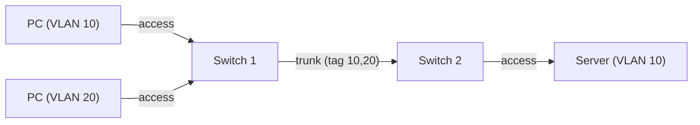

## 1. Vì sao cần biết

VLAN là cách chia một switch vật lý thành nhiều mạng L2 tách biệt (server, người dùng, quản
trị, khách...). Hầu hết sự cố khi triển khai máy ảo, hypervisor, K8s node đều liên quan:
sai VLAN trên access port, trunk không cho phép VLAN cần thiết, native VLAN không khớp. Nắm
VLAN và 802.1Q giúp chẩn đoán nhanh kiểu "ping được cùng host nhưng không ra ngoài".

## 2. Khái niệm cốt lõi

- **VLAN**: một broadcast domain logic, định danh bằng VLAN ID 12 bit (1–4094 dùng được; 0 và 4095 dành riêng).
- **Access port**: port thuộc đúng 1 VLAN, frame ra/vào không mang tag (thiết bị đầu cuối không biết VLAN).
- **Trunk port**: port mang nhiều VLAN, frame được gắn tag 802.1Q (4 byte: TPID `0x8100` + PCP/DEI + VLAN ID) để phân biệt.
- **Native VLAN** (Cisco; tương đương PVID untagged ở Linux bridge): VLAN mà frame đi trên trunk KHÔNG gắn tag. Hai đầu trunk phải thống nhất.
- Giao tiếp giữa 2 VLAN khác nhau cần thiết bị L3 (router, L3 switch, SVI) — xem module routing.



## 3. Cách nó hoạt động

**Tag chỉ tồn tại trên link trunk.** Switch nhận frame trên access port VLAN 10 → coi nó thuộc
VLAN 10 → khi ra trunk, chèn tag `VID=10` vào header Ethernet → switch đầu kia đọc tag, bỏ
tag, chỉ chuyển frame tới port thuộc VLAN 10. MAC table, flood và broadcast đều theo VLAN: một
broadcast VLAN 10 không bao giờ tới port VLAN 20.

**Trunk chỉ chuyển VLAN được phép (allowed list).** VLAN không có trong allowed list của trunk
sẽ bị rớt im lặng — nguyên nhân hàng đầu của "VLAN mới không thông qua switch kia".

**Native VLAN lệch là lỗi nguy hiểm**: nếu 2 đầu trunk khai native VLAN khác nhau, frame
untagged sẽ chui sang VLAN khác (rò VLAN); Cisco phát hiện qua CDP/STP và báo cảnh báo.

**MTU**: tag 802.1Q thêm 4 byte, khung tối đa 1522 byte thay vì 1518; phần lớn thiết bị hiện đại xử lý sẵn, nhưng cần lưu ý khi dùng jumbo frame.

## 4. Thực hành

Trên Linux: tạo sub-interface VLAN 10 (thao tác thật, cần root; output minh họa):

```bash
ip link add link eth0 name eth0.10 type vlan id 10
ip addr add 10.10.10.5/24 dev eth0.10
ip link set eth0.10 up
ip -d link show eth0.10
```

```
5: eth0.10@eth0: <BROADCAST,MULTICAST,UP,LOWER_UP> mtu 1500 ... state UP
    vlan protocol 802.1Q id 10 <REORDER_HDR>
```

Linux bridge có VLAN filtering (tương đương trunk/access):

```bash
ip link add br0 type bridge vlan_filtering 1
bridge vlan add dev eth1 vid 10 pvid untagged   # access VLAN 10
bridge vlan add dev eth0 vid 10                  # trunk mang VLAN 10 (tagged)
bridge vlan add dev eth0 vid 20
bridge vlan show
```

Cisco IOS (minh họa):

```
interface GigabitEthernet0/1
 switchport mode access
 switchport access vlan 10
!
interface GigabitEthernet0/24
 switchport mode trunk
 switchport trunk allowed vlan 10,20
 switchport trunk native vlan 99
```

Kiểm tra: `show vlan brief`, `show interfaces trunk`.

## 5. Lỗi thường gặp và cách chẩn đoán

**VLAN mới không thông qua trunk**
- Nguyên nhân: VLAN chưa có trong `allowed vlan` của trunk ở 1 trong các switch trung gian, hoặc VLAN chưa được tạo trên switch đó.
- Xác nhận: `show interfaces trunk` — cột "allowed and active in management domain".
- Xử lý: thêm VLAN (`switchport trunk allowed vlan add 30`) — nhớ dùng `add`, tránh ghi đè danh sách.

**Máy cắm vào mà không lấy được DHCP/ping gateway**
- Nguyên nhân: access port sai VLAN, hoặc port đang là trunk trong khi máy không gửi tag.
- Xác nhận: `show interfaces <port> switchport`, so với VLAN của gateway.

**Native VLAN mismatch**
- Nguyên nhân: 2 đầu khai khác nhau. Xác nhận bằng log `%CDP-4-NATIVE_VLAN_MISMATCH`. Xử lý: thống nhất, và không dùng VLAN 1 làm native/VLAN dữ liệu.

**Máy ảo trên hypervisor không ra mạng**
- Nguyên nhân: port switch nối host là access thay vì trunk, hoặc VLAN của port group không nằm trong allowed list. Xử lý: cấu hình trunk đúng và khớp tag.

## 6. Tình huống thực tế

Team tạo VLAN 30 cho cụm máy ảo mới; VM trên host A ping được nhau nhưng VM ở host B không thấy gateway.

1. Host B nối vào switch 2; gateway nằm sau switch lõi. `show vlan brief` trên switch 2: VLAN 30 chưa tồn tại.
2. `show interfaces trunk` trên uplink: VLAN 30 không "active in management domain".
3. Tạo VLAN 30 trên switch 2 và thêm vào allowed list trunk uplink.
4. VM ở host B nhận DHCP và ping được gateway. Ghi runbook: tạo VLAN mới phải kiểm tra thủ công
   mọi switch trên đường đi (trừ khi có công cụ đồng bộ VLAN tự động, nằm ngoài phạm vi bài này).

## 7. Tự kiểm tra

1. Khác biệt giữa access port và trunk port?
   <details><summary>Đáp án</summary>Access: 1 VLAN, frame không tag. Trunk: nhiều VLAN, frame gắn tag 802.1Q (trừ native VLAN).</details>

2. Dải VLAN ID dùng được là bao nhiêu và vì sao?
   <details><summary>Đáp án</summary>1–4094 (VID 12 bit = 0–4095; 0 và 4095 dành riêng).</details>

3. Hai máy ở VLAN 10 và VLAN 20 trên cùng switch có ping được nhau không, cần gì?
   <details><summary>Đáp án</summary>Không nếu chưa có L3: cần router/L3 switch (SVI/inter-VLAN routing).</details>

4. Tag 802.1Q chiếm bao nhiêu byte?
   <details><summary>Đáp án</summary>4 byte (TPID 0x8100 + PCP/DEI + VID).</details>

## 8. Bài liên quan và nguồn tham khảo

**Bài liên quan trong module này:**
- `networking.switching.basics`, `networking.switching.stp`, `networking.switching.lacp`

**Nguồn tham khảo:**
- [802.1q VLAN — kernel docs](https://docs.kernel.org/networking/8021q.html)
- [bridge(8) — man7.org](https://man7.org/linux/man-pages/man8/bridge.8.html) — `bridge vlan`.
- [ip-link(8) — man7.org](https://man7.org/linux/man-pages/man8/ip-link.8.html) — `type vlan`.
