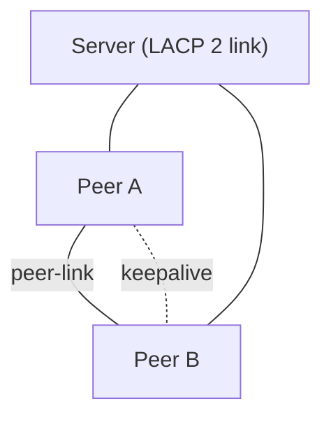

## 1. Vì sao cần biết

LACP chuẩn chỉ gộp link tới một switch, nên switch trở thành điểm lỗi đơn (SPOF). Với datacenter,
server/hypervisor/storage cần nối vào 2 switch khác nhau mà vẫn dùng được cả hai đường và không
bị STP chặn. MLAG (Multi-Chassis Link Aggregation) giải quyết bằng cách để 2 switch giả làm
1 thiết bị logic với đối tác. Bài này nêu khái niệm; chi tiết lệnh phụ thuộc hãng.

## 2. Khái niệm cốt lõi

- **MLAG**: tên chung; Cisco gọi **vPC** (Nexus), Arista MLAG, Juniper MC-LAG, Dell VLT.
- **vPC domain**: cặp 2 switch (peer) cùng domain ID, trình bày với thiết bị downstream như 1 hệ LACP duy nhất.
- **Peer-link**: link (thường port-channel tốc độ cao) giữa 2 peer để đồng bộ trạng thái (MAC, cấu hình) và chuyển lưu lượng khi cần.
- **Peer-keepalive**: kênh riêng (thường qua mạng quản trị, không đi qua peer-link) để phát hiện peer sống/chết — giúp tránh split-brain.
- **vPC member port**: port-channel nối xuống server/switch downstream, có cùng vPC ID ở hai peer.
- Với dự phòng gateway: dùng FHRP (HSRP/VRRP) hoặc anycast gateway, xem module routing.



## 3. Cách nó hoạt động

Server nhìn 2 switch qua 2 link như cùng 1 partner LACP (cùng system ID) nên bundle bình thường.
Mỗi peer đồng bộ bảng MAC/ARP với peer kia qua peer-link. Lưu lượng đi qua link cục bộ để tránh
vượt peer-link (nguyên tắc: peer-link chỉ nên chở lưu lượng bất thường).

**Khi peer-link đứt**: peer thứ yếu (secondary) dùng keepalive kiểm tra peer chính còn sống; nếu còn, secondary tắt vPC member port của nó để tránh hai bên cùng chuyển tiếp (split-brain). Nếu cả peer-link và keepalive đều mất, có thể xảy ra split-brain — vì thế keepalive phải đi đường độc lập.

**Lưu ý thiết kế:** cấu hình vPC phải nhất quán hai peer (VLAN, STP mode, MTU) — có cơ chế kiểm tra consistency; lệch cấu hình có thể làm vPC bị treo (suspended). Thứ tự nâng cấp phần mềm cũng cần theo hướng dẫn hãng — TODO-VERIFY với tài liệu phiên bản đang dùng.

## 4. Thực hành

Không có thiết bị Nexus trong môi trường soạn bài, nên cấu hình dưới đây là **ví dụ minh họa** theo cấu trúc NX-OS, cần đối chiếu tài liệu phiên bản của bạn:

```
feature vpc
feature lacp
vpc domain 10
  peer-keepalive destination 10.0.0.2 source 10.0.0.1 vrf management
interface port-channel1
  switchport mode trunk
  vpc peer-link
interface port-channel20
  switchport mode trunk
  vpc 20
```

Lệnh kiểm tra thường dùng: `show vpc`, `show vpc consistency-parameters`, `show port-channel summary`.

Phía server Linux không cần biết vPC, chỉ cấu hình bond 802.3ad bình thường (xem bài LACP) và nối mỗi NIC vào một peer.

## 5. Lỗi thường gặp và cách chẩn đoán

**vPC bị suspended / consistency check fail**
- Nguyên nhân: cấu hình hai peer lệch (allowed VLAN, STP mode, MTU).
- Xác nhận: `show vpc consistency-parameters`. Xử lý: đồng bộ cấu hình.

**Peer-keepalive đi qua peer-link**
- Nguyên nhân: thiết kế sai. Hậu quả: đứt peer-link thì mất luôn keepalive → split-brain. Xử lý: đưa keepalive sang mạng quản trị/VRF riêng.

**Server chỉ lên 1 link**
- Nguyên nhân: vPC ID không khớp hai peer hoặc LACP không thoả thuận. Xác nhận: `show vpc`, `/proc/net/bonding/bond0` phía Linux.

## 6. Tình huống thực tế

Bảo trì switch peer A (reboot). Server bond 2 NIC, nghĩ rằng mất 1 link vẫn ổn nhưng bị gián đoạn vài giây.

1. Kiểm tra bond: `lacp_rate slow` nên phát hiện link chết lâu (tối đa vài chục giây).
2. Đổi `lacp_rate fast` và `miimon 100` cho bond — failover nhanh hơn.
3. Lập kế hoạch bảo trì: chuyển lưu lượng khỏi peer A trước (graceful), reboot từng peer một, kiểm tra `show vpc` giữa các bước.
4. Ghi runbook: bảo trì từng peer, xác nhận cả hai đã đồng bộ lại trước khi động tới peer kia.

## 7. Tự kiểm tra

1. Vấn đề nào của LACP chuẩn mà MLAG/vPC giải quyết?
   <details><summary>Đáp án</summary>LACP chuẩn chỉ nối tới 1 switch; MLAG cho nối tới 2 switch khác nhau, loại SPOF mà vẫn dùng cả hai link.</details>

2. Peer-keepalive để làm gì và vì sao không nên đi qua peer-link?
   <details><summary>Đáp án</summary>Phát hiện peer còn sống để tránh split-brain; nếu đi qua peer-link thì đứt peer-link làm mất cả keepalive.</details>

3. Server có cần cấu hình đặc biệt cho vPC không?
   <details><summary>Đáp án</summary>Không, chỉ LACP chuẩn; vPC nằm ở phía switch.</details>

## 8. Bài liên quan và nguồn tham khảo

**Bài liên quan trong module này:** `networking.switching.lacp`, `networking.switching.stp`

**Nguồn tham khảo:**
- [Linux Ethernet Bonding Driver HOWTO — kernel docs](https://docs.kernel.org/networking/bonding.html) — phía server.
- Tài liệu vPC của hãng (Cisco Nexus vPC Configuration Guide) — TODO-VERIFY: chưa fetch/kiểm tra URL đúng phiên bản.
