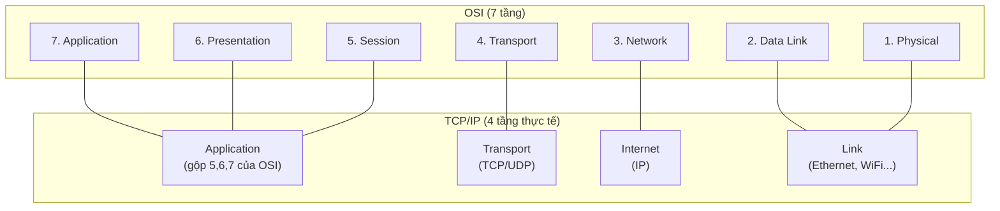

## 1. Vì sao cần biết

Khi một web app "không load được", câu hỏi đầu tiên của một SE kinh nghiệm không phải "ứng
dụng lỗi gì" mà là "vấn đề đang nằm ở TẦNG nào" — DNS không phân giải được (tầng ứng dụng)? TCP
không bắt tay được (tầng giao vận)? Không có route tới đích (tầng mạng)? Cáp/switch port down
(tầng liên kết dữ liệu)? Mô hình phân tầng không phải lý thuyết hàn lâm — nó là KHUNG CHẨN ĐOÁN
giúp thu hẹp phạm vi tìm lỗi từ "cả hệ thống mạng" xuống "một tầng cụ thể" trong vài bước, thay
vì đoán ngẫu nhiên.

## 2. Khái niệm cốt lõi

Hai mô hình phân tầng phổ biến — OSI (7 tầng, chủ yếu dùng để GIẢI THÍCH/dạy học) và TCP/IP
(4-5 tầng, đúng với cách Internet THẬT SỰ hoạt động):



| Tầng TCP/IP | Vai trò | Ví dụ |
|---|---|---|
| Application | Giao thức ứng dụng cụ thể | HTTP, DNS, SSH |
| Transport | Giao-nhận giữa 2 TIẾN TRÌNH (qua port) | TCP, UDP |
| Internet | Định tuyến giữa các MẠNG khác nhau | IP, ICMP |
| Link | Truyền giữa 2 thiết bị TRÊN CÙNG MẠNG VẬT LÝ | Ethernet, ARP, WiFi |

## 3. Cách nó hoạt động

**Mỗi tầng chỉ "nói chuyện" với ĐÚNG một tầng tương ứng ở phía bên kia, không quan tâm tầng
khác đang làm gì** — đây là nguyên lý ENCAPSULATION: tầng Application tạo dữ liệu, tầng
Transport "bọc" thêm header TCP/UDP (chứa port nguồn/đích), tầng Internet bọc thêm header IP
(chứa địa chỉ IP nguồn/đích), tầng Link bọc thêm header Ethernet (chứa địa chỉ MAC). Khi gói
tin tới đích, quá trình "tháo" diễn ra ngược lại, từng tầng chỉ đọc đúng header của NÓ rồi
chuyển phần còn lại lên tầng trên. Đây là lý do một ứng dụng viết bằng HTTP không cần biết gì
về Ethernet hay cáp mạng vật lý bên dưới — tầng Application chỉ cần tin tưởng tầng Transport
"giao đúng, giao đủ" dữ liệu.

**TCP/IP không có tầng Presentation/Session riêng như OSI — vì thực tế không cần thiết tách
biệt**: khác với hình dung phổ biến, TCP/IP (Cerf & Kahn, đầu thập niên 1970, chạy thật trên
ARPANET, trở thành chuẩn bắt buộc từ 1983) ra đời và được TRIỂN KHAI THẬT TRƯỚC mô hình OSI 7
tầng (ISO công bố chuẩn X.200 năm 1984). OSI là khung LÝ THUYẾT ra đời SAU, nhằm chuẩn hoá quốc
tế một cách tổng quát hơn — nhưng chưa bao giờ được triển khai rộng thành bộ giao thức thật, vì
TCP/IP đã chiếm lĩnh thực tế trước khi OSI hoàn thiện. TCP/IP không tách Presentation/Session
đơn giản vì nó được RÚT RA từ cách Internet THẬT đã vận hành — các chức năng đó (mã hoá, nén,
quản lý session) trong thực tế được xử lý NGAY TRONG tầng ứng dụng (ví dụ TLS — một chức năng
"Presentation" theo cách phân loại OSI — chạy ngay trong tầng ứng dụng của TCP/IP, giữa HTTP và
TCP), không cần một tầng riêng để mô tả đúng. Đây là lý do tài liệu Linux/networking thực hành
hiện đại hầu như luôn dùng mô hình 4 tầng TCP/IP, chỉ nhắc OSI 7 tầng cho mục đích SO SÁNH
thuật ngữ.

**Debug theo tầng = thu hẹp phạm vi nghi ngờ một cách có hệ thống**: nếu `ping` (tầng
Internet) thành công nhưng `curl` một URL HTTP (tầng Application) thất bại, nhiều khả năng
không nằm ở tầng Link/Internet (đã xác nhận hoạt động) — phải nằm ở tầng Transport (TCP
connect/port chặn) hoặc Application (service không chạy, DNS sai). Đi "từ dưới lên" (Link →
Internet → Transport → Application) hoặc "từ trên xuống" đều là chiến lược hợp lý, miễn có hệ
thống, không nhảy lung tung giữa các tầng theo cảm tính.

## 4. Thực hành

Xem tầng Link (Ethernet) — địa chỉ MAC của interface thật đang dùng (chạy thật trên máy):

```bash
$ ip addr show enp1s0
2: enp1s0: <BROADCAST,MULTICAST,UP,LOWER_UP> mtu 1500 qdisc fq_codel state UP group default qlen 1000
    link/ether 24:6a:0e:74:b3:b7 brd ff:ff:ff:ff:ff:ff
    inet 192.168.25.227/23 brd 192.168.25.255 scope global dynamic noprefixroute enp1s0
```

Dòng `link/ether 24:6a:...` là địa chỉ MAC — thông tin TẦNG LINK. Dòng `inet 192.168.25.227/23`
là địa chỉ IP — thông tin TẦNG INTERNET. CÙNG một lệnh `ip addr` hiển thị thông tin của HAI
tầng khác nhau cho cùng một interface vật lý — xác nhận đúng khái niệm "mỗi tầng có identifier
riêng, hoạt động độc lập" (MAC để giao tiếp trong mạng LAN, IP để định tuyến xuyên mạng).

Xem tầng Transport — port đang dùng cho một kết nối TCP thật đang mở trên máy:

```bash
$ ss -tn state established
Recv-Q Send-Q  Local Address:Port    Peer Address:PortProcess
0      0      192.168.25.227:44982  140.82.112.26:443
```

`192.168.25.227:44982` (local) và `140.82.112.26:443` (peer, cổng `443` = HTTPS) — cặp
`IP:port` này CHÍNH LÀ thông tin tầng Transport, xác định đúng MỘT kết nối cụ thể giữa hai tiến
trình, khác với tầng Internet (chỉ IP, không có port, không biết tiến trình nào đang dùng).

Xem tầng Internet — bảng định tuyến quyết định gói tin tới đích bằng đường nào:

```bash
$ ip route show
default via 192.168.24.1 dev enp1s0 proto dhcp metric 100
192.168.24.0/23 dev enp1s0 proto kernel scope link src 192.168.25.227 metric 100
```

Dòng `default via 192.168.24.1` — MỌI gói tin không khớp route cụ thể nào khác sẽ được gửi tới
gateway này — quyết định hoàn toàn ở TẦNG INTERNET, không liên quan gì tới port/tiến trình (tầng
Transport) hay địa chỉ MAC cụ thể (tầng Link, dù về sau cũng cần ARP để biết MAC của gateway).

## 5. Lỗi thường gặp và cách chẩn đoán

**`ping` tới một IP thành công nhưng truy cập web (HTTP) tới IP đó thất bại**
- Nguyên nhân: `ping` chỉ xác nhận tầng Internet (ICMP) hoạt động — KHÔNG đảm bảo tầng
  Transport (TCP) hay Application (HTTP service) hoạt động. Vấn đề thường nằm ở: service không
  chạy, firewall chặn đúng port TCP đó, hoặc service chạy nhưng lỗi logic ứng dụng.
- Cách xác nhận: `curl -v <url>` hoặc `telnet <ip> <port>`/`nc -zv <ip> <port>` xem có "connect
  được" ở tầng TCP không, trước khi nghi ngờ tầng Application.
- Cách xử lý: thu hẹp đúng tầng bị lỗi trước khi sửa — đừng debug "mạng" khi vấn đề thật nằm ở
  service chưa chạy.

**Nhầm địa chỉ MAC và địa chỉ IP là "cùng một thứ", chỉ khác định dạng**
- Nguyên nhân: cả hai đều là "địa chỉ", dễ gây nhầm cho người mới — nhưng MAC gắn với THIẾT BỊ
  VẬT LÝ (tầng Link, không đổi khi đổi mạng), IP gắn với VỊ TRÍ MẠNG LOGIC (tầng Internet, đổi
  khi thiết bị chuyển mạng).
- Cách xác nhận: cùng một thiết bị (cùng MAC) có thể có NHIỀU IP khác nhau tuỳ mạng đang kết
  nối (ví dụ đổi WiFi) — bằng chứng rõ hai khái niệm độc lập.
- Cách xử lý: không có "cách xử lý" vì đây là khái niệm, chỉ cần nhớ đúng vai trò từng tầng khi
  đọc output `ip addr`.

**Debug lan man "chắc do mạng" khi gặp lỗi ứng dụng, không xác định được tầng cụ thể**
- Nguyên nhân: thiếu quy trình hệ thống — nhảy thẳng vào nghi ngờ cấu hình phức tạp (DNS,
  firewall, routing) mà không xác nhận từng tầng từ thấp lên cao hoặc ngược lại.
- Cách xác nhận: không có lệnh cụ thể — đây là vấn đề PHƯƠNG PHÁP, không phải vấn đề kỹ thuật.
- Cách xử lý: luôn đi qua đủ các bước cơ bản theo tầng — `ip addr` (Link/Internet có địa chỉ
  đúng không) → `ip route`/`ping` (Internet có tới được đích không) → `ss`/`telnet` (Transport
  có connect được không) → log ứng dụng (Application có lỗi logic không) — dừng lại NGAY khi
  tìm thấy tầng đầu tiên có vấn đề.

## 6. Tình huống thực tế

Một ứng dụng nội bộ báo "không kết nối được database" từ server app tới server DB (cùng mạng
LAN nội bộ, khác subnet).

1. Theo đúng quy trình từ thấp lên cao: `ip addr` trên server app — xác nhận có IP hợp lệ, đúng
   subnet dự kiến (tầng Internet có địa chỉ, chưa xác nhận tới được đích).
2. `ping <ip-db-server>` — THÀNH CÔNG, xác nhận tầng Internet (routing) hoạt động bình thường
   giữa hai server — loại trừ ngay vấn đề về route/firewall chặn ICMP.
3. `nc -zv <ip-db-server> 5432` (giả sử PostgreSQL, port 5432) — THẤT BẠI, "Connection refused"
   — xác nhận vấn đề nằm ở tầng Transport/Application, KHÔNG phải routing/network như đoán ban
   đầu của team (ai đó đã định mở ticket cho team network trước khi kiểm tra kỹ).
4. Trên server DB: `ss -tlnp | grep 5432` — database chỉ LISTEN trên `127.0.0.1:5432` (chỉ chấp
   nhận kết nối từ CHÍNH máy đó), không bind `0.0.0.0:5432` (mọi interface) — đây là nguyên
   nhân thật: cấu hình database chưa cho phép kết nối từ xa, không liên quan gì tới mạng.
5. Sửa cấu hình database (bind đúng interface/IP cần, mở đúng rule firewall nếu có), restart
   service, test lại `nc -zv` thành công.
6. Ghi vào runbook: "Connection refused" ở tầng TCP gần như LUÔN là service không listen đúng
   địa chỉ/port (vấn đề Application), KHÁC với "Connection timed out" (thường là vấn đề routing/
   firewall ở tầng thấp hơn) — hai loại lỗi này đáng để phân biệt ngay từ đầu, tránh report sai
   team xử lý.

## 7. Tự kiểm tra

1. `ping` một server thành công nhưng SSH vào server đó bị treo (không connect). Vấn đề nhiều
   khả năng nằm ở tầng nào?
   <details><summary>Đáp án</summary>Không phải tầng Internet (ping đã xác nhận routing/ICMP ổn)
   — khả năng cao ở tầng Transport (firewall chặn port 22, hoặc SSH daemon không chạy) hoặc
   Application (SSH service lỗi).</details>

2. Vì sao cùng một máy laptop có thể giữ NGUYÊN địa chỉ MAC nhưng đổi địa chỉ IP khi chuyển từ
   WiFi nhà sang WiFi công ty?
   <details><summary>Đáp án</summary>MAC gắn với THIẾT BỊ VẬT LÝ (card mạng), không đổi theo
   môi trường. IP là địa chỉ LOGIC gắn với MẠNG đang kết nối — đổi mạng (đổi tầng Internet) thì
   IP phải đổi theo để định tuyến đúng, dù tầng Link (MAC) không đổi.</details>

3. Tại sao TCP/IP (mô hình thực tế) không tách riêng tầng Presentation/Session như OSI?
   <details><summary>Đáp án</summary>Vì chức năng của hai tầng đó (mã hoá/nén, quản lý session)
   trong thực tế được xử lý NGAY trong tầng ứng dụng (ví dụ TLS nằm giữa HTTP và TCP, vẫn thuộc
   "Application" theo TCP/IP) — không cần một tầng riêng biệt để mô tả đúng cách Internet vận
   hành thật.</details>

4. `nc -zv <ip> <port>` trả về "Connection refused" ngay lập tức. Điều này cho biết gì khác với
   "Connection timed out"?
   <details><summary>Đáp án</summary>"Refused" nghĩa là gói tin TỚI ĐƯỢC đích (tầng Internet
   ổn) nhưng KHÔNG CÓ service nào lắng nghe đúng port đó (tầng Application/Transport) — máy
   đích chủ động gửi lại TCP RST. "Timed out" nghĩa là gói tin KHÔNG TỚI ĐƯỢC đích hoặc phản
   hồi không quay lại được — thường là vấn đề routing/firewall ở tầng thấp hơn.</details>

5. Vì sao "đi theo tầng" (từ Link lên Application, hoặc ngược lại) là chiến lược debug tốt hơn
   so với đoán ngẫu nhiên nguyên nhân?
   <details><summary>Đáp án</summary>Vì mỗi bước xác nhận MỘT tầng hoạt động hay không sẽ LOẠI
   TRỪ toàn bộ các tầng đã xác nhận ổn khỏi danh sách nghi ngờ, thu hẹp phạm vi tìm lỗi một
   cách có hệ thống — tránh lãng phí thời gian điều tra sai tầng (ví dụ debug firewall khi vấn
   đề thật là service chưa chạy).</details>

## 8. Bài liên quan và nguồn tham khảo

**Bài liên quan trong module này:**
- `networking.tcpip.ipv4-subnetting` — chi tiết hơn về địa chỉ IP (tầng Internet) đã nhắc ở
  bài này.
- `networking.tcpip.tcp-udp` — chi tiết hơn về tầng Transport (TCP/UDP, port, handshake).

**Bài liên quan ngoài module:**
- `linux.network-stack.tools` — công cụ `ip`/`ss` dùng trong bài này, với góc nhìn vận hành
  Linux cụ thể hơn.

**Nguồn tham khảo:**
- [tcp(7) — man7.org](https://man7.org/linux/man-pages/man7/tcp.7.html) — đặc tả TCP trên
  Linux, xác nhận vai trò tầng Transport.
- [ip(7) — man7.org](https://man7.org/linux/man-pages/man7/ip.7.html) — đặc tả IP trên Linux,
  xác nhận vai trò tầng Internet.
