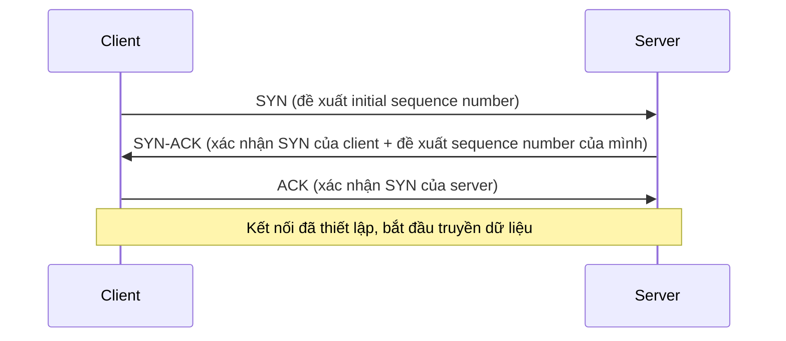

## 1. Vì sao cần biết

"Vì sao DNS lại chạy UDP mà không phải TCP như web?", "Vì sao video call đôi khi giật hình
nhưng không bao giờ 'treo' chờ load lại như trang web?" — câu trả lời nằm ở lựa chọn thiết kế
TCP vs UDP. Đây không phải lựa chọn tuỳ ý của từng ứng dụng mà là đánh đổi CÓ CHỦ ĐÍCH giữa độ
tin cậy (TCP đảm bảo mọi byte tới đúng, đủ, đúng thứ tự) và độ trễ/thông lượng (UDP không đảm
bảo gì, nhưng nhanh hơn vì không có overhead xác nhận/sắp xếp lại). Hiểu đúng đánh đổi này giúp
SE chẩn đoán đúng khi một dịch vụ "chập chờn" hay quyết định đúng protocol khi thiết kế hệ
thống mới.

## 2. Khái niệm cốt lõi

| | TCP | UDP |
|---|---|---|
| Kết nối | Connection-oriented (phải bắt tay trước khi gửi dữ liệu) | Connectionless (gửi ngay, không cần thiết lập trước) |
| Độ tin cậy | Đảm bảo tới đủ, đúng thứ tự, tự động gửi lại gói mất | Không đảm bảo gì — gói có thể mất, trùng, sai thứ tự |
| Overhead | Cao hơn (header lớn hơn, cần ACK, quản lý cửa sổ) | Thấp (header nhỏ, không cần theo dõi trạng thái) |
| Dùng cho | HTTP/HTTPS, SSH, database connection | DNS, video/voice call thời gian thực, HTTP/3 (QUIC) |

TCP thiết lập kết nối qua **3-way handshake** (theo RFC 9293):



## 3. Cách nó hoạt động

**Vì sao cần 3 bước, không phải 2 (client gửi, server trả lời là xong)?** — mỗi bên cần XÁC
NHẬN sequence number RIÊNG của phía MÌNH ĐÃ ĐƯỢC BÊN KIA NHẬN: bước 1 (SYN) client đề xuất số
thứ tự của NÓ; bước 2 (SYN-ACK) server xác nhận đã nhận, ĐỒNG THỜI đề xuất số thứ tự của CHÍNH
NÓ; bước 3 (ACK) client xác nhận đã nhận số của server. Thiếu bước 3, server không biết client
có THẬT SỰ nhận được SYN-ACK của nó không — có thể gói SYN-ACK bị mất giữa đường, server vẫn
tưởng kết nối đã thiết lập trong khi client không hề biết gì.

**UDP không hề "kém" TCP — nó là lựa chọn ĐÚNG cho dữ liệu mà "cũ thì vô giá trị"**: với video
call, một frame hình bị mất giữa chừng — việc TCP RETRANSMIT (gửi lại) frame đó không có ý
nghĩa gì, vì tới lúc gửi lại xong, thời điểm hiển thị đúng của frame đó đã trôi qua lâu rồi —
tốt hơn là BỎ QUA frame mất, tiếp tục hiển thị frame mới nhất (giật hình nhẹ) hơn là DỪNG LẠI
chờ TCP đảm bảo đủ dữ liệu (gây trễ tích lũy, trải nghiệm tệ hơn). DNS cũng chọn UDP vì mỗi
query độc lập, nhỏ, nếu mất thì CLIENT TỰ RETRY TOÀN BỘ query đơn giản hơn nhiều so với chi phí
duy trì một TCP connection cho mỗi query riêng lẻ (DNS CÓ hỗ trợ TCP cho response lớn, nhưng UDP
vẫn là mặc định cho query thông thường).

**"Cửa sổ trượt" (sliding window) là cơ chế TCP dùng để KIỂM SOÁT LƯỢNG DỮ LIỆU gửi đi trước khi
cần ACK, không phải gửi 1 byte chờ ACK rồi mới gửi tiếp**: nếu TCP phải chờ ACK cho MỖI byte,
tốc độ truyền sẽ cực chậm trên kết nối có độ trễ (latency) cao. Cửa sổ trượt cho phép gửi MỘT
LƯỢNG dữ liệu (kích thước cửa sổ) TRƯỚC khi cần nhận ACK đầu tiên — kích thước này được điều
chỉnh ĐỘNG dựa trên khả năng nhận của phía kia (flow control, qua `SO_RCVBUF`) VÀ tình trạng
nghẽn mạng (congestion control — nhiều thuật toán khác nhau: Reno, BIC, CUBIC...). Đây là lý do
TCP "tự thích nghi" tốc độ theo điều kiện mạng thực tế, không truyền với tốc độ cố định.

## 4. Thực hành

Xem kết nối TCP thật đang mở trên máy (`ESTAB` = đã hoàn tất handshake, đang truyền dữ liệu):

```bash
$ ss -tn
State Recv-Q Send-Q  Local Address:Port    Peer Address:Port
ESTAB 0      0      192.168.25.227:37640  140.82.113.26:443
ESTAB 0      0      192.168.25.227:44650 142.250.198.37:443
```

Mỗi dòng là MỘT kết nối TCP cụ thể, xác định bởi 4-tuple: `(local IP, local port, peer IP,
peer port)` — port `443` ở phía peer xác nhận đây là HTTPS, các kết nối khác nhau dù cùng peer
port vì local port khác nhau (hệ điều hành tự cấp port tạm — ephemeral port — cho mỗi kết nối
outgoing mới).

Xem UDP THẬT đang dùng — chú ý: port `443` cũng xuất hiện ở UDP (không chỉ TCP), nhiều khả
năng là HTTP/3 (QUIC — giao thức mới chạy TRÊN UDP, không phải TCP) theo đúng quy ước cổng
443/UDP, nhưng `ss` KHÔNG tự xác nhận giao thức tầng ứng dụng thật — muốn chắc chắn 100% cần
bắt gói (`tcpdump`/Wireshark, đọc header QUIC) hoặc xem log trình duyệt, không chỉ suy luận từ
số port:

```bash
$ ss -un
Recv-Q Send-Q         Local Address:Port     Peer Address:Port
0      0             192.168.25.227:47205 142.250.197.142:443
```

Dù chưa xác nhận tuyệt đối giao thức cụ thể, đây vẫn là minh chứng đủ cho ý chính: KHÔNG phải
"web luôn dùng TCP" một cách tuyệt đối — nếu đúng là QUIC, nó xây lại cơ chế tin cậy CỦA RIÊNG
NÓ trên nền UDP, để có kiểm soát tốt hơn việc xử lý mất gói so với TCP (một cải tiến engineering
gần đây, không mâu thuẫn với nguyên lý TCP/UDP đã học
— chỉ là tầng ứng dụng tự xây lại độ tin cậy khi cần, thay vì dùng sẵn của TCP).

Xem một truy vấn DNS THẬT qua UDP, xác nhận ngay trong output:

```bash
$ dig example.com
;; SERVER: 127.0.0.53#53(127.0.0.53) (UDP)
;; MSG SIZE  rcvd: 72
```

Dòng `(UDP)` được `dig` tự in ra xác nhận đúng giao thức đã dùng cho query này; `MSG SIZE rcvd:
72` (chỉ 72 byte) cho thấy kích thước nhỏ TYPICAL của DNS — lý do UDP (overhead thấp) phù hợp
hơn TCP cho loại truy vấn ngắn, độc lập này.

## 5. Lỗi thường gặp và cách chẩn đoán

**Chọn UDP cho một giao thức tự viết CẦN đảm bảo dữ liệu tới đủ/đúng thứ tự, nhưng không tự
xây cơ chế đảm bảo riêng**
- Nguyên nhân: nhầm UDP "nhẹ hơn nên luôn tốt hơn" — UDP không tự đảm bảo gì, nếu ứng dụng cần
  độ tin cậy mà không tự implement (sequence number, ACK, retransmit riêng như QUIC đã làm),
  dữ liệu sẽ bị mất/sai thứ tự mà không ai biết.
- Cách xác nhận: test trên mạng có packet loss/jitter thật (không chỉ test trên localhost
  hoàn hảo) — lỗi dữ liệu thiếu/sai thứ tự xuất hiện rõ.
- Cách xử lý: dùng TCP nếu không có lý do đặc biệt cần tối ưu độ trễ hơn độ tin cậy; nếu thực
  sự cần UDP (hiệu năng), phải tự xây cơ chế đảm bảo tối thiểu cần thiết (không cần đầy đủ như
  TCP, nhưng phải CÓ gì đó).

**Server không phản hồi SYN, client bị "treo" chờ kết nối rất lâu trước khi timeout**
- Nguyên nhân: packet SYN bị DROP (không phải REJECT) — thường do firewall chặn im lặng (drop,
  không gửi lại gì) thay vì từ chối rõ ràng (reject, gửi RST ngay) — client phải chờ hết
  timeout TCP (khá lâu, tuỳ hệ điều hành) mới báo lỗi.
- Cách xác nhận: so sánh với trường hợp "Connection refused" (phản hồi ngay, RST) — "treo lâu
  rồi mới timeout" là dấu hiệu DROP, khác REJECT.
- Cách xử lý: kiểm tra rule firewall giữa client-server, xác nhận có đang DROP SYN một cách
  im lặng không (có thể là chủ ý bảo mật — "security through obscurity" — nhưng cần biết rõ
  đây là chủ đích, không phải lỗi cấu hình).

**Nhầm việc thấy port UDP đang "mở" (LISTEN hoặc có traffic) với việc kết nối đó đã được xác
thực/thiết lập giống TCP**
- Nguyên nhân: UDP không có khái niệm "connection established" thật ở tầng giao thức (dù
  `ss -un` có thể hiện thông tin peer nếu ứng dụng dùng `connect()` cho UDP socket, đây chỉ là
  tiện ích ở tầng OS, không phải handshake thật).
- Cách xác nhận: không có trạng thái `ESTAB` thật cho UDP như TCP — `ss -un` chỉ hiện socket
  đang tồn tại, không xác nhận "hai bên đã thống nhất gì" như TCP.
- Cách xử lý: không áp dụng tư duy "connection" của TCP cho UDP khi debug — mỗi datagram UDP
  độc lập, phải kiểm tra ở tầng ứng dụng (ví dụ log DNS server) để biết giao tiếp có thực sự
  thành công không.

## 6. Tình huống thực tế

Một ứng dụng VoIP nội bộ báo "chất lượng âm thanh tệ, giật đoạn" trên một số kết nối mạng,
trong khi ứng dụng web khác trên CÙNG mạng chạy bình thường.

1. Xác nhận ứng dụng VoIP dùng RTP qua UDP (chuẩn ngành cho voice/video real-time) — đúng lựa
   chọn kỹ thuật (ưu tiên độ trễ thấp hơn độ tin cậy tuyệt đối).
2. `mtr`/`ping` giữa hai điểm — phát hiện tỉ lệ mất gói ~3-5%, đủ để ảnh hưởng UDP (không có
   retransmit tự động).
3. Giải thích tại sao web (TCP) không bị ảnh hưởng rõ như VoIP (UDP) ở CÙNG mức packet loss:
   TCP tự động gửi lại gói mất, người dùng web chỉ thấy load chậm hơn chút. VoIP (không
   retransmit ở tầng giao vận) thể hiện TRỰC TIẾP packet loss thành giật/rè âm thanh — cùng
   tỉ lệ mất gói, hệ quả cảm nhận khác hẳn vì lựa chọn protocol khác nhau.
4. Không "chuyển VoIP sang TCP" để giải quyết packet loss — sẽ gây trễ (chờ retransmit) còn tệ
   hơn cho real-time audio. Hướng đúng: giảm packet loss ở tầng mạng (switch/router/WiFi).
5. Xác định đoạn mạng gây mất gói bằng `mtr` từng đoạn, xử lý đúng nguyên nhân hạ tầng.
6. Ghi vào runbook: debug VoIP/video call không "đổi sang TCP" — luôn điều tra nguyên nhân
   packet loss ở tầng mạng, vì lựa chọn UDP cho real-time media vốn đã đúng.

## 7. Tự kiểm tra

1. Vì sao TCP handshake cần đúng 3 bước (SYN, SYN-ACK, ACK), không phải 2 bước?
   <details><summary>Đáp án</summary>Mỗi bên cần xác nhận sequence number RIÊNG của mình đã
   được bên kia nhận. Thiếu bước ACK cuối, server không có cách nào biết client đã thực sự
   nhận được SYN-ACK của nó hay chưa (gói đó có thể đã bị mất giữa đường).</details>

2. DNS chọn UDP làm giao thức mặc định cho truy vấn thông thường. Vì sao lựa chọn này hợp lý,
   dù UDP không đảm bảo gói tin tới đích?
   <details><summary>Đáp án</summary>Mỗi truy vấn DNS nhỏ, độc lập — nếu mất, client chỉ cần
   gửi lại TOÀN BỘ query (đơn giản, chi phí thấp), không cần một kết nối TCP đầy đủ (chi phí
   handshake + duy trì state) cho một thao tác ngắn như vậy. Overhead thấp của UDP phù hợp
   hơn chi phí thiết lập TCP cho tác vụ này.</details>

3. Một video call bị mất một frame hình giữa chừng. TCP (nếu dùng) sẽ làm gì với frame đó? Vì
   sao đây KHÔNG phải hành vi mong muốn cho video call thời gian thực?
   <details><summary>Đáp án</summary>TCP sẽ TỰ ĐỘNG gửi lại (retransmit) frame bị mất, đảm bảo
   nó tới đích. Đây không mong muốn cho real-time vì tới lúc frame đó gửi lại xong, thời điểm
   hiển thị đúng của nó đã trôi qua — tốt hơn là bỏ qua, tiếp tục hiển thị frame mới nhất (UDP),
   thay vì dừng lại chờ đảm bảo đủ dữ liệu cũ.</details>

4. Client gửi SYN, không nhận được phản hồi gì, phải chờ rất lâu mới timeout. Khác gì với
   trường hợp nhận "Connection refused" ngay lập tức?
   <details><summary>Đáp án</summary>"Treo lâu rồi timeout" thường là SYN bị DROP (im lặng,
   không phản hồi gì — ví dụ bởi firewall chặn không báo). "Connection refused" là phản hồi
   NGAY bằng TCP RST — máy đích tới được nhưng không có service nào lắng nghe đúng port
   đó.</details>

5. Vì sao HTTP/3 (QUIC) chạy trên UDP thay vì TCP, dù web truyền thống (HTTP/1.1, HTTP/2) luôn
   dùng TCP?
   <details><summary>Đáp án</summary>QUIC tự xây lại cơ chế đảm bảo tin cậy CỦA RIÊNG NÓ trên
   nền UDP, cho phép kiểm soát tốt hơn việc xử lý mất gói/tối ưu hiệu năng (ví dụ tránh vấn đề
   "head-of-line blocking" của TCP khi nhiều stream dùng chung một kết nối) — không mâu thuẫn
   với nguyên lý TCP/UDP, chỉ là tầng ứng dụng chọn tự xây độ tin cậy riêng thay vì dùng sẵn
   của TCP.</details>

## 8. Bài liên quan và nguồn tham khảo

**Bài liên quan trong module này:**
- `networking.tcpip.osi-tcpip-model` — vai trò tầng Transport mà bài này đi sâu hơn.

**Bài liên quan ngoài module:**
- `networking.diagnostic-tools.ss-netstat` — dùng `ss` chi tiết hơn để kiểm tra trạng thái
  kết nối TCP/UDP trong thực tế vận hành.

**Nguồn tham khảo:**
- [tcp(7) — man7.org](https://man7.org/linux/man-pages/man7/tcp.7.html) — đặc tả TCP trên
  Linux, cửa sổ trượt, congestion control.
- [udp(7) — man7.org](https://man7.org/linux/man-pages/man7/udp.7.html) — đặc tả UDP trên
  Linux, xác nhận connectionless/unreliable.
- [RFC 9293](https://www.rfc-editor.org/rfc/rfc9293.html) — đặc tả chính thức hiện hành của
  TCP (thay thế RFC 793), định nghĩa 3-way handshake.
