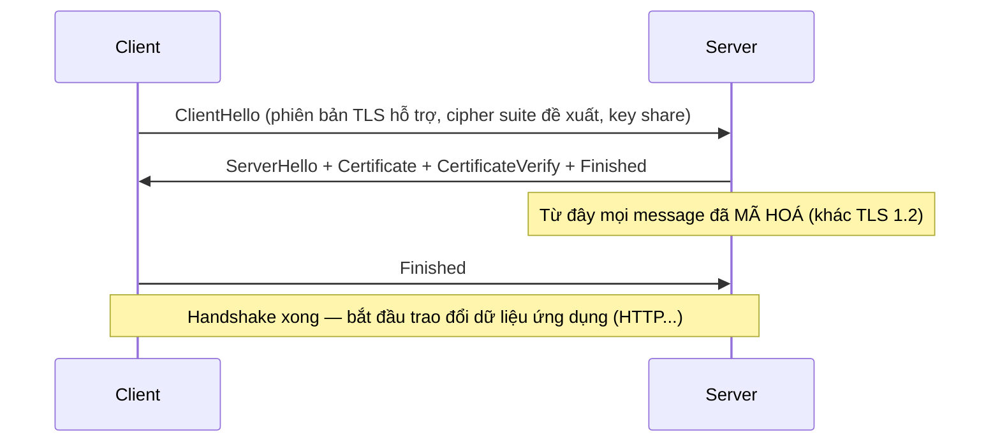

## 1. Vì sao cần biết

"HTTPS bị lỗi" là một trong những báo cáo mơ hồ nhất SE nhận được — có thể là chứng chỉ hết
hạn, sai hostname, thiếu chứng chỉ trung gian, hay đơn giản là cipher suite không tương thích
giữa client cũ và server mới. TLS không phải "hộp đen" chỉ cần `https://` là xong — hiểu đúng
TỪNG BƯỚC của handshake giúp đọc được output `openssl s_client`/`curl -v` và biết NGAY lỗi nằm
ở bước nào, thay vì đoán mò "chắc do chứng chỉ" cho mọi loại lỗi TLS.

## 2. Khái niệm cốt lõi

TLS (Transport Layer Security) chạy TRÊN TCP, trước khi dữ liệu HTTP (hay bất kỳ protocol nào)
được trao đổi — mục tiêu: (1) XÁC THỰC server (và tuỳ chọn cả client) đúng là ai, (2) THỐNG
NHẤT khoá mã hoá dùng chung mà KHÔNG AI nghe trộm được dù truyền qua kênh công khai, (3) MÃ HOÁ
toàn bộ dữ liệu sau đó.

Handshake TLS 1.3 (hiện đại, 1-RTT — nhanh hơn TLS 1.2 cần 2-RTT):



**Cipher suite** = bộ 4 thuật toán được thống nhất dùng chung: key exchange, xác thực, mã hoá
đối xứng, hash — ví dụ `TLS_AES_256_GCM_SHA384` (AES-256-GCM mã hoá, SHA384 cho hash/MAC).

## 3. Cách nó hoạt động

**TLS 1.3 nhanh hơn TLS 1.2 vì GIẢM SỐ VÒNG round-trip (1-RTT thay vì 2-RTT)** — theo đúng RFC
8446: TLS 1.2 cần round-trip RIÊNG để thống nhất tham số TRƯỚC KHI server gửi Certificate. TLS
1.3 gộp lại: server gửi NGAY `ServerHello` + `Certificate` + `CertificateVerify` + `Finished`
trong CÙNG một lượt phản hồi, và MÃ HOÁ toàn bộ các message này ngay sau `ServerHello` (TLS 1.2
để lộ Certificate ở dạng CHƯA mã hoá) — giảm một vòng round-trip giúp giảm LATENCY đáng kể,
đặc biệt quan trọng cho kết nối di động có RTT cao.

**`CertificateVerify` là bước server CHỨNG MINH nó SỞ HỮU private key tương ứng với chứng chỉ
đã gửi** — chỉ gửi Certificate (public, ai cũng xem được) KHÔNG đủ để xác thực; server phải
TỰ KÝ một phần dữ liệu handshake bằng private key của nó, client dùng public key TRONG
certificate để xác minh chữ ký đó khớp — nếu server KHÔNG CÓ private key thật (ví dụ chỉ copy
chứng chỉ public mà không có key), bước này THẤT BẠI, handshake bị huỷ dù Certificate "nhìn"
hợp lệ.

**Chuỗi tin cậy (chain of trust) — client KHÔNG tự "biết" một CA có đáng tin hay không, nó
TRA TRONG DANH SÁCH CA ROOT đã cài sẵn**: mỗi hệ điều hành/browser có một danh sách CA ROOT
được tin cậy SẴN (ví dụ `/etc/ssl/certs/ca-certificates.crt` trên Linux). Server gửi chứng chỉ
của NÓ (ký bởi một CA trung gian), client phải LẦN THEO chuỗi (server cert → CA trung gian →
CA root) tới khi gặp một CA ROOT NẰM TRONG danh sách tin cậy sẵn có — nếu THIẾU chứng chỉ CA
TRUNG GIAN trong chuỗi server gửi, client không lần được tới root, báo lỗi dù root CA đó THẬT
SỰ có trong danh sách tin cậy (lỗi cấu hình server phổ biến, chi tiết hơn ở bài
`networking.tls-pki.troubleshooting`).

## 4. Thực hành

Xem TOÀN BỘ các bước handshake TLS 1.3 THẬT (chạy `curl -v` tới domain công khai):

```bash
$ curl -v --stderr - -o /dev/null https://example.com 2>&1 | head -20
* TLSv1.3 (OUT), TLS handshake, Client hello (1):
* TLSv1.3 (IN), TLS handshake, Server hello (2):
* TLSv1.3 (IN), TLS handshake, Encrypted Extensions (8):
* TLSv1.3 (IN), TLS handshake, Certificate (11):
* TLSv1.3 (IN), TLS handshake, CERT verify (15):
* TLSv1.3 (IN), TLS handshake, Finished (20):
```

Đọc đúng khớp lý thuyết mục 2-3: `Client hello` → `Server hello` → (ngay sau đó ĐÃ MÃ HOÁ)
`Encrypted Extensions` → `Certificate` → `CERT verify` (chính là `CertificateVerify` đã giải
thích ở mục 3) → `Finished` — toàn bộ trong MỘT lượt trao đổi, đúng 1-RTT.

Xem chi tiết cipher suite và kết quả xác thực chứng chỉ (`openssl s_client`):

```bash
$ echo | openssl s_client -connect example.com:443 -servername example.com 2>/dev/null \
    | grep -E "Protocol|Cipher|Verify"
New, TLSv1.3, Cipher is TLS_AES_256_GCM_SHA384
Verify return code: 0 (ok)
```

`Verify return code: 0 (ok)` xác nhận chuỗi tin cậy ĐÃ lần được tới một CA root tin cậy sẵn có
trên máy — đây là con số QUAN TRỌNG NHẤT cần nhìn đầu tiên khi debug TLS (khác `0` nghĩa là có
vấn đề, xem mã lỗi cụ thể ở bài troubleshooting).

Xem thông tin chứng chỉ server đang dùng (subject/issuer/thời hạn — chạy thật):

```bash
$ echo | openssl s_client -connect example.com:443 -servername example.com 2>/dev/null \
    | openssl x509 -noout -subject -issuer -dates
subject=CN = example.com
issuer=C = US, O = SSL Corporation, CN = Cloudflare TLS Issuing ECC CA 3
notBefore=Sep 26 22:49:11 2026 GMT
notAfter=Dec 25 22:56:35 2026 GMT
```

`issuer` KHÁC `subject` — xác nhận đây là chứng chỉ ký bởi MỘT CA (Cloudflare), không phải
self-signed (self-signed sẽ có `subject` và `issuer` GIỐNG NHAU — xem bài tiếp theo).

## 5. Lỗi thường gặp và cách chẩn đoán

**Handshake thất bại ngay ở bước `CertificateVerify`, dù Certificate "nhìn" hợp lệ**
- Nguyên nhân: server KHÔNG CÓ private key đúng tương ứng với certificate đang dùng (ví dụ
  deploy nhầm certificate của domain khác, hoặc private key bị mất/sai trong lúc cấu hình).
- Cách xác nhận: `openssl x509 -noout -modulus -in cert.pem | openssl md5` so với
  `openssl rsa -noout -modulus -in key.pem | openssl md5` — hai giá trị PHẢI GIỐNG NHAU nếu
  cert và key thực sự là một cặp.
- Cách xử lý: xác nhận và deploy ĐÚNG cặp cert+key tương ứng, không nhầm lẫn giữa nhiều domain
  trên cùng server.

**Client báo lỗi chuỗi tin cậy dù CA root ĐÚNG LÀ có trong danh sách tin cậy của hệ thống**
- Nguyên nhân: server THIẾU gửi chứng chỉ CA TRUNG GIAN (intermediate) trong chuỗi — client
  không "tự tìm" được intermediate nếu server không gửi kèm, dù root cuối cùng có tin cậy.
- Cách xác nhận: `openssl s_client -connect <host>:443 -showcerts` xem SỐ LƯỢNG chứng chỉ
  server gửi — thiếu 1 cấp trung gian so với chuỗi đầy đủ mong đợi.
- Cách xử lý: cấu hình server gửi ĐẦY ĐỦ chain (server cert + mọi intermediate), không chỉ
  server cert đơn lẻ — hầu hết CA cung cấp sẵn file "fullchain"/"chain" để dùng đúng.

**Cipher suite không tương thích, client CŨ không kết nối được tới server đã tắt cipher cũ**
- Nguyên nhân: server (vì lý do an toàn) chỉ bật cipher suite HIỆN ĐẠI, trong khi client dùng
  thư viện TLS CŨ không hỗ trợ các cipher đó.
- Cách xác nhận: `openssl s_client -connect <host>:443 -cipher <cipher-cũ>` thất bại ngay ở
  bước `ClientHello`/`ServerHello` (không thống nhất được cipher chung).
- Cách xử lý: cân nhắc giữ lại MỘT SỐ cipher cũ (đánh đổi an toàn) nếu BẮT BUỘC hỗ trợ client
  cũ, hoặc yêu cầu nâng cấp client — không có cách "ép" hai bên dùng cipher không tương thích.

## 6. Tình huống thực tế

Một ứng dụng mobile cũ (không update được ngay) báo lỗi SSL handshake khi gọi API, trong khi
browser hiện đại gọi CÙNG API vẫn hoạt động bình thường.

1. `openssl s_client -connect api.example.com:443` từ máy dev — THÀNH CÔNG, `Verify return
   code: 0`, cipher `TLS_AES_256_GCM_SHA384` (TLS 1.3) — xác nhận server hoạt động đúng với
   client hiện đại.
2. Kiểm tra log server — thấy các request từ mobile app cũ bị FAIL ngay ở bước handshake, log
   server ghi "no shared cipher" — khác hẳn lỗi chứng chỉ (loại trừ ngay hướng điều tra sai).
3. Xác nhận: thư viện TLS trong app mobile cũ (built từ nhiều năm trước) chỉ hỗ trợ TLS 1.1/1.2
   với cipher suite CŨ — server đã tắt hoàn toàn các cipher này trong lần nâng cấp bảo mật gần
   đây (chỉ còn TLS 1.3 + cipher hiện đại).
4. Cân nhắc đánh đổi: mở lại MỘT cipher TLS 1.2 tương đối an toàn (không mở toàn bộ cipher cũ
   không an toàn) CHỈ cho tới khi app mobile được update, kèm theo dõi log xem còn client nào
   dùng cipher đó để biết khi nào có thể tắt hẳn.
5. Thêm giải pháp dài hạn: ép buộc version tối thiểu của app mobile qua App Store/Play Store,
   từng bước loại bỏ hoàn toàn nhu cầu hỗ trợ cipher cũ.
6. Ghi vào runbook: khi NÂNG CẤP cấu hình TLS (tắt cipher cũ), PHẢI kiểm tra TRƯỚC danh sách
   client/app đang dùng (đặc biệt app mobile cũ không update được ngay) — không nâng cấp "cho
   an toàn" mà không đánh giá tác động tương thích ngược.

## 7. Tự kiểm tra

1. Vì sao TLS 1.3 chỉ cần 1 vòng round-trip (1-RTT) để hoàn tất handshake, trong khi TLS 1.2
   cần 2?
   <details><summary>Đáp án</summary>TLS 1.3 gộp việc gửi Certificate/CertificateVerify/
   Finished vào NGAY sau ServerHello trong cùng một lượt phản hồi, và mã hoá các message này
   ngay từ đó — không cần một vòng round-trip riêng để thống nhất tham số trước như TLS
   1.2.</details>

2. Server gửi một Certificate hợp lệ (đúng domain, còn hạn), nhưng handshake vẫn thất bại ở
   bước `CertificateVerify`. Nguyên nhân khả năng cao nhất là gì?
   <details><summary>Đáp án</summary>Server không có ĐÚNG private key tương ứng với
   certificate đó — CertificateVerify là bước server phải TỰ KÝ bằng private key để chứng
   minh sở hữu, chỉ có certificate (public) không đủ để qua bước này.</details>

3. Vì sao thiếu chứng chỉ CA trung gian (intermediate) trong chuỗi server gửi có thể gây lỗi
   "chuỗi tin cậy", dù CA root cuối cùng THẬT SỰ nằm trong danh sách tin cậy của client?
   <details><summary>Đáp án</summary>Client không tự "tìm" được chứng chỉ intermediate thiếu
   — nó chỉ lần theo CHUỖI mà server GỬI KÈM. Thiếu một cấp trung gian khiến client không lần
   được tới root dù root đó có tin cậy, vì "đường đi" trong chuỗi bị đứt đoạn.</details>

4. `openssl s_client ... | grep Verify` trả về `Verify return code: 0 (ok)`. Điều này xác nhận
   gì?
   <details><summary>Đáp án</summary>Chuỗi tin cậy (chain of trust) đã được xác thực thành
   công — chứng chỉ server lần theo được tới một CA root nằm trong danh sách tin cậy sẵn có
   trên máy đang chạy lệnh. Khác 0 nghĩa là có vấn đề với chuỗi tin cậy.</details>

5. Một client cũ chỉ hỗ trợ cipher suite đã bị server tắt (vì lý do an toàn). Có cách nào "ép"
   hai bên thống nhất được cipher chung mà không đổi cấu hình bên nào không?
   <details><summary>Đáp án</summary>Không — hai bên PHẢI có ít nhất một cipher suite CHUNG để
   thống nhất trong ClientHello/ServerHello. Không có cách ép buộc nếu không có giao điểm; phải
   đổi cấu hình MỘT trong hai bên (mở lại cipher cũ ở server, hoặc nâng cấp client) để có cipher
   chung.</details>

## 8. Bài liên quan và nguồn tham khảo

**Bài liên quan trong module này:**
- `networking.tls-pki.pki-cert-mgmt` — chi tiết hơn về CA, chuỗi chứng chỉ, cách quản lý/gia
  hạn.
- `networking.tls-pki.troubleshooting` — các lỗi TLS/SSL thường gặp, mở rộng từ mục 5-6 ở bài
  này.

**Nguồn tham khảo:**
- [RFC 8446 — TLS 1.3](https://www.rfc-editor.org/rfc/rfc8446) — đặc tả chính thức handshake,
  lý do 1-RTT.
