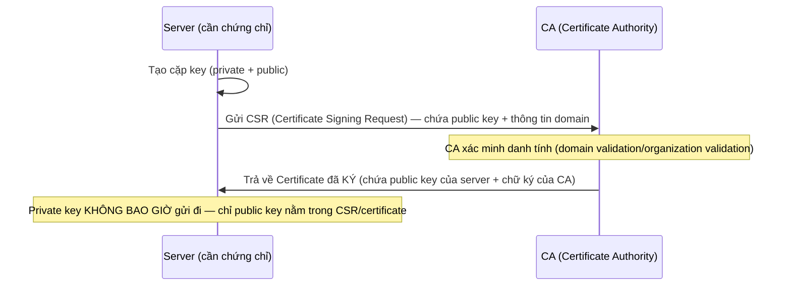

## 1. Vì sao cần biết

Bài trước học CÁCH TLS dùng chứng chỉ trong handshake; bài này học CÁCH chứng chỉ được TẠO RA
và QUẢN LÝ — vì SE thường phải tự tạo chứng chỉ nội bộ (cho môi trường dev/test, dịch vụ internal
không cần CA public), hoặc GIA HẠN chứng chỉ trước khi hết hạn (quên gia hạn là một trong những
nguyên nhân outage "ngớ ngẩn nhất" nhưng vẫn xảy ra thường xuyên trong thực tế). Hiểu đúng quy
trình CSR → ký → chuỗi tin cậy giúp tự tạo PKI nội bộ đúng cách, không chỉ copy lệnh mà không
hiểu từng bước làm gì.

## 2. Khái niệm cốt lõi

Quy trình tạo một chứng chỉ được CA ký (3 bước, 2 bên tham gia):



**CSR (Certificate Signing Request)**: file chứa public key + thông tin (Common Name/domain,
Organization...) — KHÔNG chứa private key. **Self-signed certificate**: chứng chỉ mà
`subject` và `issuer` GIỐNG NHAU (tự ký bằng private key của chính nó, không qua CA nào) — dùng
cho CA gốc tự tạo (nội bộ) hoặc test, KHÔNG được browser/client tin cậy sẵn (phải tự cài vào
danh sách CA tin cậy nếu muốn dùng thật).

## 3. Cách nó hoạt động

**Private key KHÔNG BAO GIỜ rời khỏi máy tạo ra nó — đây là nguyên tắc BẤT BIẾN của PKI**: khi
tạo CSR, chỉ PUBLIC key được đưa vào file gửi cho CA — CA ký (bằng private key CỦA CHÍNH CA)
để xác nhận "public key này thuộc về domain X", rồi trả lại CERTIFICATE (chứa public key +
chữ ký CA). Private key GỐC của server không bao giờ cần gửi đi bất cứ đâu trong toàn bộ quy
trình — nếu một quy trình YÊU CẦU gửi private key cho ai đó (kể cả CA), đó là dấu hiệu CẢNH
BÁO nghiêm trọng về thiết kế sai hoặc lừa đảo.

**CA tự tạo (self-signed) hoạt động được THẬT, nhưng chỉ trong phạm vi "ai tin tưởng CA đó"**:
không có gì về mặt KỸ THUẬT ngăn một tổ chức tự tạo CA riêng, tự ký chứng chỉ cho các server
nội bộ — hoàn toàn hoạt động đúng với TLS handshake (đã học ở bài trước). Vấn đề DUY NHẤT: các
máy client KHÁC (chưa cài CA đó vào danh sách tin cậy) sẽ báo lỗi "chứng chỉ không tin cậy" —
đây KHÔNG phải lỗi, mà là ĐÚNG NHƯ THIẾT KẾ của PKI (không ai nên tự động tin một CA lạ). Giải
pháp: CHỦ ĐỘNG cài CA nội bộ đó vào danh sách tin cậy của MỌI máy cần truy cập (qua quản lý tập
trung, ví dụi Group Policy/MDM/config management), không phải "lỗi cần sửa ở server".

**`openssl x509 -checkend` cho phép TỰ ĐỘNG kiểm tra sắp hết hạn TRƯỚC khi thực sự hết hạn** —
cơ sở để xây dựng cảnh báo gia hạn chủ động: cờ này nhận số giây, trả `true`/exit code phù hợp
nếu chứng chỉ sẽ hết hạn trong khoảng đó — thay vì tự tính ngày hết hạn rồi so sánh tay, dùng
NGAY công cụ có sẵn để viết script cảnh báo tự động (ví dụ cron job chạy hằng ngày, cảnh báo
nếu còn dưới 30 ngày).

## 4. Thực hành

Toàn bộ quy trình PKI THẬT — tạo CA tự ký, tạo CSR cho server, CA ký CSR, xác thực chuỗi (chạy
thật bằng `openssl`, trong thư mục tạm, không ảnh hưởng hệ thống):

```bash
# Bước 1: Tạo CA tự ký (self-signed — subject và issuer sẽ GIỐNG NHAU)
$ openssl req -x509 -newkey rsa:2048 -keyout ca.key -out ca.crt -days 365 -nodes \
    -subj "/CN=SE-Dojo-Demo-CA"
$ openssl x509 -in ca.crt -noout -subject -issuer
subject=CN = SE-Dojo-Demo-CA
issuer=CN = SE-Dojo-Demo-CA
```

`subject` = `issuer` — xác nhận ĐÚNG đây là self-signed, đúng khớp định nghĩa ở mục 2.

```bash
# Bước 2: Server tạo key + CSR (CHƯA có chữ ký CA, chỉ là "đơn xin ký")
$ openssl req -newkey rsa:2048 -keyout server.key -out server.csr -nodes \
    -subj "/CN=app.se-dojo.local"
$ openssl req -in server.csr -noout -subject
subject=CN = app.se-dojo.local
```

```bash
# Bước 3: CA ký CSR → tạo ra Certificate THẬT
$ openssl x509 -req -in server.csr -CA ca.crt -CAkey ca.key -CAcreateserial \
    -out server.crt -days 365
Certificate request self-signature ok
$ openssl x509 -in server.crt -noout -subject -issuer
subject=CN = app.se-dojo.local
issuer=CN = SE-Dojo-Demo-CA
```

Giờ `subject` (`app.se-dojo.local`) KHÁC `issuer` (`SE-Dojo-Demo-CA`) — đúng một chứng chỉ
được KÝ BỞI CA, không còn self-signed.

```bash
# Bước 4: Xác thực chuỗi — client "tin" ca.crt sẽ chấp nhận server.crt
$ openssl verify -CAfile ca.crt server.crt
server.crt: OK
```

Kiểm tra tự động "còn hạn hay sắp hết hạn" (cho mục đích viết script cảnh báo — ví dụ kiểm tra
còn hạn ít nhất 30 ngày = 2592000 giây):

```bash
$ openssl x509 -in server.crt -noout -checkend 2592000 && echo "Còn hạn > 30 ngày"
Certificate will not expire
Còn hạn > 30 ngày
```

## 5. Lỗi thường gặp và cách chẩn đoán

**Quên gia hạn chứng chỉ, dịch vụ "tự nhiên" báo lỗi TLS đúng vào một ngày cụ thể**
- Nguyên nhân: chứng chỉ có THỜI HẠN CỐ ĐỊNH (thường 90 ngày tới vài năm tuỳ CA) — không ai
  theo dõi/cảnh báo chủ động dẫn tới hết hạn mà không ai biết trước.
- Cách xác nhận: `openssl x509 -in cert.crt -noout -enddate` xem chính xác ngày hết hạn; nếu
  đã QUA ngày đó, xác nhận đúng nguyên nhân.
- Cách xử lý ngay: gia hạn/renew chứng chỉ gấp. Phòng tránh dài hạn: thiết lập job TỰ ĐỘNG kiểm
  tra `-checkend` định kỳ (hằng ngày) cho MỌI chứng chỉ production, cảnh báo sớm (30-14-7 ngày
  trước hết hạn), hoặc dùng cơ chế auto-renew (ví dụ Let's Encrypt + certbot) nếu phù hợp.

**Tự tạo CA nội bộ, cài chứng chỉ server đúng, nhưng máy client khác vẫn báo "không tin cậy"**
- Nguyên nhân: ĐÚNG như thiết kế PKI (mục 3) — client đó CHƯA cài CA nội bộ vào danh sách tin
  cậy của nó, không phải lỗi cấu hình server.
- Cách xác nhận: `openssl verify -CAfile ca.crt server.crt` (có chỉ định ĐÚNG file CA) chạy
  `OK` — xác nhận chứng chỉ server hoàn toàn hợp lệ, vấn đề chỉ nằm ở phía CLIENT chưa tin CA.
- Cách xử lý: cài CA nội bộ vào danh sách tin cậy của MỌI máy cần truy cập (qua quản lý tập
  trung), không "sửa" gì ở server vì server không có gì sai.

**Nhầm private key của SERVER với private key của CA, dẫn tới lộ key CA ra ngoài phạm vi an
toàn**
- Nguyên nhân: không phân biệt rõ "key của server" (có thể cần đặt trên nhiều máy để TLS
  termination) với "key của CA" (PHẢI giữ cực kỳ an toàn — lộ key CA nghĩa là ai đó có thể ký
  giả MỌI chứng chỉ mà CA đó được tin cậy).
- Cách xác nhận: kiểm tra lại quy trình lưu trữ — key CA có đang nằm cùng chỗ với key server
  thông thường, có được backup/truy cập rộng rãi như file cấu hình khác không.
- Cách xử lý: cách ly HOÀN TOÀN private key của CA (HSM, hoặc tối thiểu máy riêng biệt, quyền
  truy cập rất hẹp) — tuyệt đối không xử lý như một file cấu hình thông thường.

## 6. Tình huống thực tế

Một dịch vụ nội bộ (dùng CA tự tạo của công ty) đột ngột báo lỗi TLS trên TOÀN BỘ máy client
vào đúng 00:00 một ngày, dù không ai thay đổi gì trong cấu hình server.

1. `openssl x509 -in /etc/ssl/internal-ca.crt -noout -enddate` — phát hiện: CA ROOT nội bộ
   (không phải chứng chỉ server) đã HẾT HẠN đúng vào thời điểm lỗi xảy ra.
2. Phân biệt với lỗi chứng chỉ SERVER thông thường: ở đây là CA ROOT hết hạn — ảnh hưởng
   TOÀN BỘ chứng chỉ được CA đó ký (không chỉ một server cụ thể), giải thích vì sao lỗi xảy ra
   ĐỒNG LOẠT trên nhiều dịch vụ cùng lúc.
3. Vấn đề phức tạp hơn gia hạn chứng chỉ server thông thường: gia hạn CA ROOT đồng nghĩa phải
   TẠO LẠI CA (hoặc gia hạn nếu công cụ hỗ trợ) VÀ phân phối lại CA mới tới TOÀN BỘ máy client
   đã tin cậy CA cũ — một quy trình lớn hơn nhiều so với renew một chứng chỉ server đơn lẻ.
4. Xử lý khẩn cấp: tạo CA mới, ký lại TOÀN BỘ chứng chỉ server đang dùng CA cũ, đồng thời đẩy
   CA mới tới các máy client qua kênh quản lý tập trung sẵn có (nếu có) để giảm thời gian gián
   đoạn.
5. Nếu KHÔNG có kênh phân phối tập trung sẵn — đây là lỗ hổng vận hành nghiêm trọng hơn chính
   sự cố hết hạn, cần khắc phục ngay sau khi xử lý xong sự cố trước mắt.
6. Ghi vào runbook: CA ROOT nội bộ cần thời hạn ĐỦ DÀI (nhiều năm, vì ảnh hưởng toàn hệ thống
   khi hết hạn) và PHẢI có trong danh sách giám sát `-checkend` ưu tiên CAO NHẤT — hết hạn CA
   root nghiêm trọng hơn RẤT NHIỀU so với hết hạn một chứng chỉ server đơn lẻ, vì phạm vi ảnh
   hưởng rộng hơn và quy trình khắc phục phức tạp hơn nhiều.

## 7. Tự kiểm tra

1. Khi tạo CSR để xin CA ký chứng chỉ, file CSR có chứa private key của server không?
   <details><summary>Đáp án</summary>Không. CSR chỉ chứa PUBLIC key và thông tin domain/
   organization — private key KHÔNG BAO GIỜ được gửi đi trong bất kỳ bước nào của quy
   trình.</details>

2. Một chứng chỉ có `subject` và `issuer` giống nhau. Đây là loại chứng chỉ gì?
   <details><summary>Đáp án</summary>Self-signed certificate — chứng chỉ tự ký bằng chính
   private key của nó, không qua một CA nào khác xác nhận.</details>

3. Client báo "chứng chỉ không tin cậy" khi kết nối tới server dùng CA nội bộ tự tạo, dù
   `openssl verify -CAfile ca.crt server.crt` trả `OK`. Vấn đề nằm ở server hay client?
   <details><summary>Đáp án</summary>Ở CLIENT — chứng chỉ server hoàn toàn hợp lệ (xác nhận
   qua verify thành công với đúng CA), chỉ là client đó chưa cài CA nội bộ vào danh sách tin
   cậy của nó. Đây đúng như thiết kế PKI, không phải lỗi server.</details>

4. Vì sao hết hạn CA ROOT nội bộ nghiêm trọng hơn nhiều so với hết hạn một chứng chỉ server
   đơn lẻ?
   <details><summary>Đáp án</summary>CA root hết hạn ảnh hưởng TOÀN BỘ chứng chỉ được CA đó ký
   (nhiều server/dịch vụ cùng lúc), và quy trình khắc phục phức tạp hơn nhiều (phải tạo/gia hạn
   CA mới VÀ phân phối lại tới mọi máy client đã tin cậy CA cũ), không chỉ renew một chứng chỉ
   đơn lẻ như trường hợp thông thường.</details>

5. Vì sao private key của CA cần được bảo vệ NGHIÊM NGẶT HƠN private key của một server thông
   thường?
   <details><summary>Đáp án</summary>Lộ private key của CA cho phép kẻ tấn công KÝ GIẢ bất kỳ
   chứng chỉ nào mà CA đó được tin cậy — ảnh hưởng toàn bộ hệ thống dùng CA đó, nghiêm trọng
   hơn nhiều so với lộ key của một server đơn lẻ (chỉ ảnh hưởng đúng server đó).</details>

## 8. Bài liên quan và nguồn tham khảo

**Bài liên quan trong module này:**
- `networking.tls-pki.handshake` — cách chứng chỉ được dùng trong handshake TLS thật.
- `networking.tls-pki.troubleshooting` — các lỗi chứng chỉ thường gặp, mở rộng từ mục 5-6.

**Nguồn tham khảo:**
- [RFC 5280](https://www.rfc-editor.org/rfc/rfc5280) — đặc tả chính thức X.509 PKI, cấu trúc
  certificate, chuỗi tin cậy.
